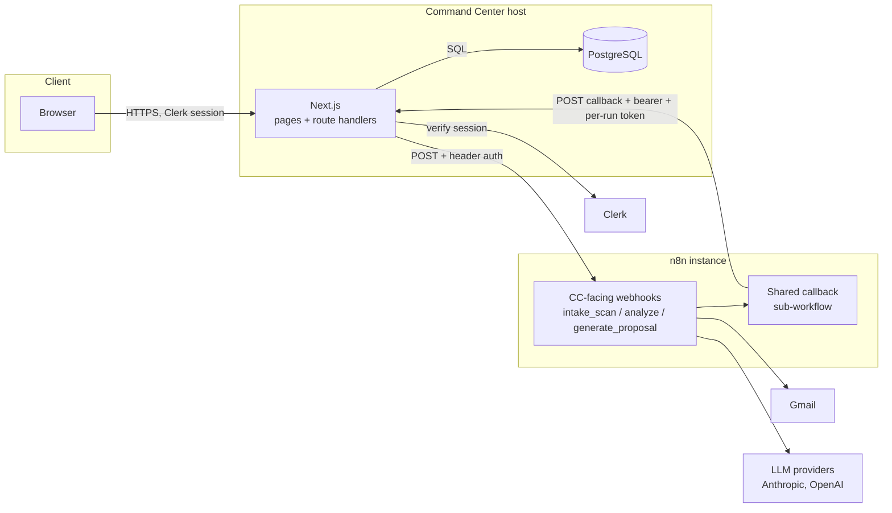
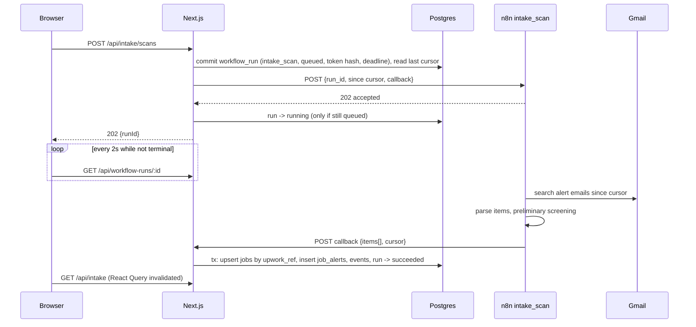
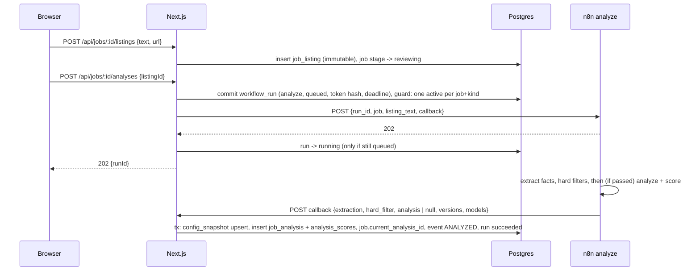
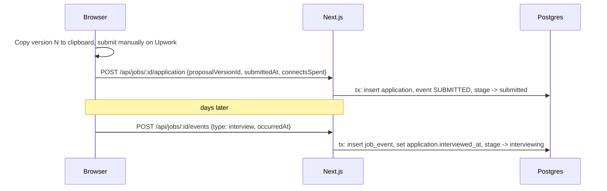
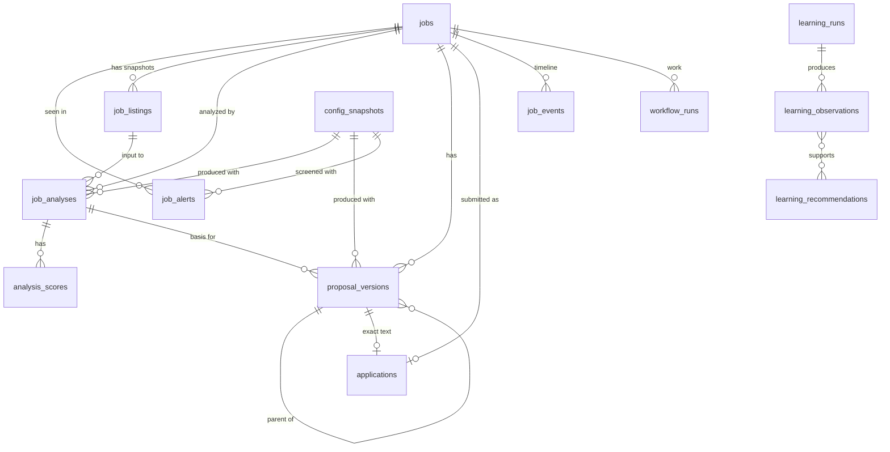
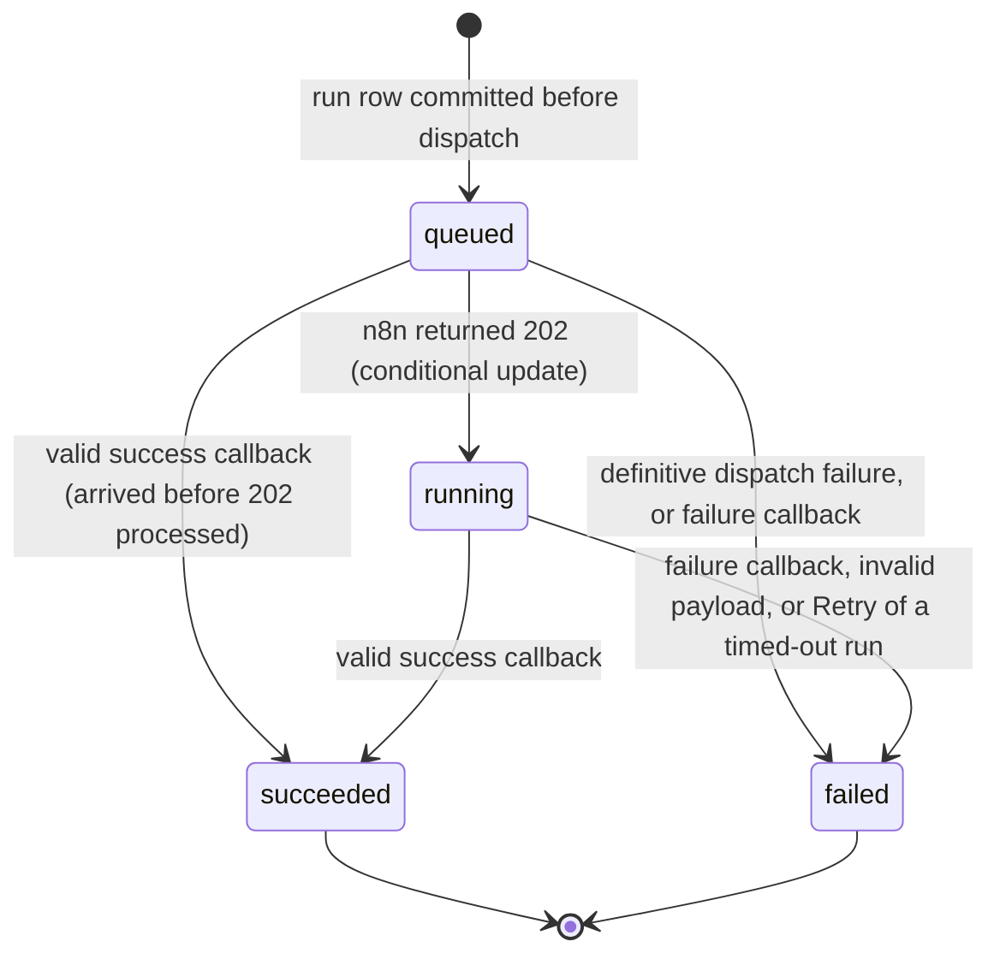

# Upwork Command Center Architecture Proposal

Status: **Direction approved; contracts not frozen.** Nothing in this document is implemented. Every JSON payload, endpoint, and table below is a design example for review, not a committed contract.

Inputs reviewed: this repository (`development` branch), and the existing n8n suite in `upwork-proposal-system/n8n/upwork-job-hunter` (README, user guide, workflow exports W00 to W99, generators, config seed). Contract shapes in Sections 4 and 5 were corrected against the live workflow exports; the evidence and the n8n migration plan are in [n8n-refactor-plan.md](./n8n-refactor-plan.md).

---

## 1. Executive Summary

The Command Center becomes the **system of record**. n8n becomes a **stateless execution engine** that receives a complete request, does the AI and integration work, and returns a structured result. The browser only ever talks to Next.js.

- **PostgreSQL**, accessed through **Drizzle ORM**, stores every job, listing snapshot, analysis, proposal version, submission, outcome, workflow run, and configuration version.
- **Next.js route handlers** are the only boundary. They authenticate the owner with Clerk, write state, and dispatch work to n8n webhooks with a server-held secret.
- **All business workflows that perform integrations, LLM work, or durable business-state changes use the asynchronous workflow-run model.** Next.js commits a callback-ready `workflow_runs` row, dispatches to n8n, n8n acknowledges immediately and later posts the result to a Command Center callback endpoint, and the UI polls the run by ID with React Query. Lightweight diagnostic operations such as health checks may be synchronous. No WebSockets, no SSE, no queue infrastructure.
- **Analyses and proposal versions are immutable.** A job is analyzed by appending a new analysis; a proposal is changed by appending a new version. The submitted version is recorded by foreign key, not by copying text into a mutable field.
- **Learning is statistics plus LLM interpretation, gated by human approval.** No autonomous prompt or weight changes.

### What this proposal pushes back on

These are places where the brief, or the current n8n design, conflicts with the stated principles or adds avoidable complexity:

1. **n8n currently owns state.** The existing suite persists everything in n8n Data Tables (`upwork_jobs`, `upwork_events`, `upwork_config`), and sub-workflows receive only a `job_id` and load state themselves. "Command Center owns state" therefore requires refactoring n8n workflows to accept full input and return results instead of writing Data Tables. This is the largest piece of work in the whole plan and must not be hidden behind "just call the webhook." Dual-writing to both stores is explicitly rejected.
2. **There is no Gmail intake today.** All current intake is manual paste (Slack or webhook). "Check Upwork Alerts" is a net-new n8n workflow plus an unknown email format. It should **not** be the first vertical slice. The paste, analyze, propose, submit path reuses proven n8n logic and replaces daily Slack use sooner.
3. **A separate `proposals` parent table adds little.** One Upwork job gets at most one application. The distinction that matters is between an immutable **proposal version** and the **application** (the real-world submission that references exactly one version and accumulates outcomes). Section 4 models it that way.
4. **The "approve / READY_TO_SUBMIT" step is redundant** in a UI where "Mark submitted" requires choosing the exact version. Recommend dropping it.
5. **Callbacks need an HTTP Request node in n8n.** The current suite has a self-imposed "0 HTTP Request nodes" rule. Asynchronous results require at least one shared callback sub-workflow. This needs your approval.
6. **Clerk alone does not make the app single-user.** If sign-ups are open, any Clerk account can reach the dashboard. Add an explicit owner check (Section 7).
7. **The reference route handlers (`/api/products`, `/api/users`) perform no auth check.** `src/proxy.ts` only attaches auth context; protection lives in the dashboard layout. New route handlers must authenticate themselves.
8. **The current n8n webhooks (`/webhook/upwork/*`) are unauthenticated** (confirmed in the W01 export: the Webhook node has no authentication set). New Command Center-facing webhooks must use header auth.
9. **The live n8n workflows have drifted from their generators, and the recorded model metadata is wrong.** The live W01 extraction and W02 analysis model nodes are hardcoded to `claude-sonnet-5-5` and the W02 fallback to `chat-latest`, while the stored `analysis_model` / extraction labels come from config keys naming different models. Historical model attribution in n8n is therefore unreliable, and Command Center-facing workflows must report the model a node actually used (details in the refactor plan).

---

## 2. System Responsibilities

| Component | Owns | Must not |
|---|---|---|
| Browser | Rendering, local UI state, URL state (nuqs), polling run status, copying text to clipboard | Hold secrets, call n8n, compute scores |
| Next.js (server) | Auth, input validation, state transitions, persistence, n8n dispatch, callback verification, read models for UI, deterministic text metrics (word count, em dash check) | Call LLMs, read Gmail, duplicate scoring logic, depend on n8n node layout |
| PostgreSQL | All durable business state and history | Be accessed by n8n directly |
| n8n | Gmail retrieval, alert parsing, preliminary screening, extraction, scoring formula, LLM/agent calls, proposal generation, prompt and model configuration (initially), Slack notifications | Be the system of record, read or write the Command Center database |
| Clerk | Authenticating the single owner | Authorization logic beyond "is this the owner" |
| Gmail | Source of Upwork alert emails (read by n8n only) | Be modified to track processing state (no labels as state) |
| LLM providers | Model inference, called only by n8n | Be called from Next.js |



---

## 3. Request Flow

All four flows share one pattern: **validate, persist intent, dispatch, persist result in one transaction.** For asynchronous runs, "persist intent" means the `workflow_runs` row, its per-run callback token hash, and its deadline are committed **before** the dispatch request is sent, so a callback can never arrive for a run the database does not yet know about (Section 8).

### 3.1 Email intake ("Check Upwork Alerts")



State changes: run created; run running; per item a `jobs` row is created if new (stage `discovered` or `screened_out`), a `job_alerts` row is always appended; scan cursor advances only on success.

### 3.2 Full job analysis



### 3.3 Proposal generation and regeneration

Same shape as analysis, with kind `generate_proposal`. Next.js sends the job facts, the listing text, the analysis narrative fields the existing strategist consumes, and (for regeneration) the base version text plus user instructions, because n8n no longer loads state itself. The proposal strategy (plan) is produced by the proposal workflow per version, not by analysis. The callback inserts one `proposal_versions` row (`origin = generated | regenerated`) with its plan, sets stage `drafting` if earlier, and appends an event.

A manual edit is **not** an n8n call: `POST /api/jobs/:id/proposal-versions` with `origin = manual_edit` creates a new version synchronously after server-side validation (including the em dash check).

### 3.4 Submission and outcome tracking



No n8n call is needed for submission or outcomes. Slack notifications for these, if still wanted, can be a fire-and-forget n8n webhook later.

Every outcome mutation writes the `applications` milestone column and the matching `job_events` row in the **same database transaction** (Section 4, `applications`).

---

## 4. Persistence Model

Conventions: UUIDv7 or ULID primary keys (time-sortable, safe to expose); `timestamptz` everywhere; Postgres enums for small closed sets; `jsonb` only for full raw payloads and evolving feature sets, never for fields that analytics will filter on routinely. No `tenant_id` or `user_id` columns (single user). Append-only tables have no `updated_at`.



### `jobs`
- **Purpose:** One row per Upwork job. Identity plus denormalized current state for fast lists.
- **Fields:** `id`, `upwork_ref` (ciphertext such as `~01abc...`, unique when present), `fingerprint` (hash of normalized text, fallback dedupe), `title`, `url`, `origin` (`email_alert | manual_paste`), `stage` (enum below), `close_reason`, `current_analysis_id`, `manual_score`, `manual_disposition`, `override_reason`, `dismiss_reason`, `created_at`, `updated_at`.
- **Notes:** `stage` and `current_analysis_id` are caches; the truth is in `job_events` and the immutable child tables. Manual overrides live here, never on the analysis, so system output is never rewritten.

### `job_alerts` (the "job source" concept)
- **Purpose:** Every time a job appears in an alert email. Needed for source quality analytics and false-positive measurement.
- **Fields:** `id`, `job_id`, `gmail_message_id` + `item_index` (unique together), `alert_name` (saved search name), `received_at`, `snippet`, `budget_text`, parsed budget fields, `posted_at`, `prelim_score`, `prelim_decision` (`qualified | rejected`), `prelim_reasons` (text[]), `screening_config_id`, `workflow_run_id`.

### `job_listings`
- **Purpose:** Immutable snapshots of the full listing the user pasted. Re-pasting an updated listing adds a row.
- **Fields:** `id`, `job_id`, `raw_text`, `text_hash` (unique per job), `source_url`, `char_count`, `created_at`.

### `job_analyses` (immutable)
- **Purpose:** One completed full analysis of one listing snapshot under one configuration.
- **Fields (names follow the live extraction and analysis schemas):**
  - Extraction: `extraction_status` (`ok | failed`), `extracted_title`, `posted_at_text`, extracted facts as typed columns (`budget_type`, `budget_min`, `budget_max`, `hourly_min`, `hourly_max`, `connect_cost`, `client_payment_verified`, `client_location`, `client_total_spend`, `client_hires`, `client_rating`, `proposal_count_text`, `proposals_min`, `proposals_max`, `job_category` (enum `NEXTJS_REACT | SENIOR_FULL_STACK | API_INTEGRATION | AI_AUTOMATION | QUICK_FIX | OTHER`), `skills` text[]), `extraction_summary`, plus the hard-filter inputs (`excludes_us_freelancers`, `is_likely_scam`, `scam_signals` text[], `refused_conditions_found` jsonb, `listing_is_incomplete`).
  - Hard filter: `hard_filter_pass`, `hard_filter_reasons` text[] (codes such as `US_FREELANCERS_EXCLUDED`, `PAYMENT_EXPLICITLY_UNVERIFIED`, `LIKELY_SCAM: ...`, `REFUSED_CONDITION: ...`, `INCOMPLETE_LISTING`).
  - Analysis (null when the hard filter failed, because no analysis runs): `weighted_score`, `red_flag_penalty`, `system_score`, `system_disposition` (`PRIORITY | REVIEW | LOW | REJECT_HARD`), `client_problem`, `client_summary`, `analysis_summary`, `recommended_positioning`, `positive_signals` text[], `red_flags` text[], `why_candidate_matches` text[], `missing_information` text[].
  - Metadata: `id`, `job_id`, `listing_id`, `workflow_run_id`, `config_snapshot_id`, `extraction_model`, `analysis_model`, `analysis_fallback_used`, `features` jsonb + `feature_schema_version` (nullable; no feature signals are extracted today, see Section 10), `raw_result` jsonb, `created_at`.
- **Decision:** Immutable and versioned by append. Re-analysis creates a new row; `jobs.current_analysis_id` points at the one in use. This preserves "original score" for learning and makes scoring-version comparisons possible. Failed analyses do not create rows; the failure lives on the run. A hard-filter rejection **is** a completed analysis row (extraction and hard-filter fields filled, analysis fields null).
- **Correction from the workflow audit:** analysis does not produce a proposal strategy, "strengths", "risks", or a free-form "reasoning" field. The live schema's equivalents are `positive_signals`, `red_flags`, per-dimension evidence, and `analysis_summary`. The proposal plan is produced per proposal version by the proposal workflow.

### `analysis_scores`
- **Purpose:** Score components, queryable per dimension.
- **Fields:** `analysis_id`, `dimension` (enum matching the live workflow keys: `technical_fit`, `budget_score`, `client_quality`, `long_term_potential`, `communication_quality`, `competition_score`, `strategic_fit`), `score` (0 to 10), `weight` (as applied, from the run's scoring weights), `evidence` (from the model's `dimension_evidence`, nullable because the schema does not require it). Primary key (`analysis_id`, `dimension`).
- **Why a table, not columns:** weights and dimensions are versioned config; a child table survives adding a dimension without a migration on every historical row.

### `proposal_versions` (immutable)
- **Purpose:** Every proposal text ever produced for a job.
- **Fields:** `id`, `job_id`, `version_number` (unique per job, sequential), `parent_version_id`, `analysis_id`, `origin` (`generated | regenerated | manual_edit`), `instructions`, `body`, `strategy` jsonb (the live plan schema: `client_real_problem`, `proposal_angle`, `opening_hook`, `relevant_experience`, `key_points`, `technical_details`, `recommended_case_study`, `include_case_study_link`, `recommended_bid_strategy`, `questions_to_client`, `risk_to_address`), `proposal_angle` and `recommended_case_study` (copied out for analytics), `strategy_model`, `strategy_fallback_used`, `writer_model`, `writer_fallback_used`, `em_dashes_removed` (count reported by the n8n sanitizer), `config_snapshot_id`, `workflow_run_id` (null for manual edits), deterministic metrics computed by Next.js at insert: `char_count`, `word_count`, `paragraph_count`, `question_count`, `em_dash_count` (must be 0 to submit), `created_at`.

### `applications`
- **Purpose:** The real-world submission. This is the record that answers "which exact version was submitted" and that outcomes attach to.
- **Fields:** `id`, `job_id` (unique), `proposal_version_id` (not null), `submitted_at`, `connects_spent`, denormalized milestones `viewed_at`, `responded_at`, `interviewed_at`, `offered_at`, `won_at`, `closed_at`, `close_reason` (`rejected | no_response | job_closed | withdrawn | other`), `contract_value`, `contract_type`.
- **Rule:** The text the user submits must be a stored version. If the user edits before submitting, the edit is saved as a `manual_edit` version first, and that version is the one recorded. The UI "Copy" action copies a specific version, so clipboard text and recorded text cannot drift.
- **Consistency rule (intentional denormalization):** the `applications` row is the convenient current-state read model; `job_events` is the append-only historical and audit model. Any mutation that changes an application milestone (`submitted_at`, `viewed_at`, `responded_at`, `interviewed_at`, `offered_at`, `won_at`, `closed_at` with `close_reason`, including lost and withdrawn) **must** insert the corresponding `job_events` row and update the `applications` row, plus `jobs.stage` when it changes, in the **same database transaction**. There is exactly one domain function per milestone that performs all three writes; nothing else writes milestone columns. If the transaction fails, neither side changes, so the two can never drift. A reconciliation query (milestone column versus latest matching event) belongs in the integration test suite.

### `job_events` (append-only)
- **Purpose:** Full timeline and audit log: stage transitions, decisions, overrides, outcomes, run completions.
- **Fields:** `id`, `job_id`, `type` (enum), `from_stage`, `to_stage`, `actor` (`owner | system | n8n`), `occurred_at` (user-supplied for outcomes), `recorded_at`, `workflow_run_id`, `payload` jsonb, `idempotency_key` (unique, nullable).

### `workflow_runs`
- **Purpose:** Every request to n8n, its lifecycle, and its correlation ID. Also the operational log for workflow health.
- **Fields:** `id` (the correlation ID sent to n8n), `kind` (`intake_scan | analyze | generate_proposal | learning_interpret`), `job_id` (nullable), `status` (persisted: `queued | running | succeeded | failed`), `contract_version`, `request` jsonb (secrets stripped), `result` jsonb, `error_code`, `error_message`, `retryable`, `callback_token_hash`, `n8n_execution_ref` (opaque, for debugging links only), `attempt`, `retry_of_run_id`, `requested_at`, `dispatched_at` (set when n8n acknowledged), `finished_at`, `deadline_at`.
- **Timeouts are derived, not stored:** the read model exposes `effective_status = 'timed_out'` when `deadline_at < now()` and the persisted status is `queued` or `running`. No read path writes. "Completed after deadline" is derivable as `finished_at > deadline_at`. See Section 8.
- **Constraint:** partial unique index on (`job_id`, `kind`) where status in (`queued`, `running`) to prevent double-clicks starting duplicate LLM runs. A run that is effectively timed out still holds this slot until it is resolved; the "Retry" action (a POST) first marks the stale run `failed` with `error_code = TIMEOUT`, then creates the new run, in one transaction.

### `config_snapshots`
- **Purpose:** Records exactly which workflow, prompt, scoring, and model versions produced each result, without the Command Center owning prompt text yet.
- **Fields:** `id`, `content_hash` (unique), `workflow_version`, `scoring_version`, `scoring_weights` jsonb, `score_thresholds` jsonb (`priority`, `review`), `hard_filter_rules` jsonb, `screening_version`, `extraction_prompt_version`, `analysis_prompt_version`, `proposal_prompt_version`, `models` jsonb, `first_seen_at`.
- **Note:** the live suite uses one `proposal_prompt_version` for both the strategist and writer prompts, and has no version key for `candidate_profile`, `candidate_skills`, or `case_studies` even though all prompts consume them. The refactor plan recommends returning a short content hash of those values so changes are detectable.
- **How it fills:** every n8n result includes a `versions` block; Next.js upserts by hash and links the result row. Phase 2 (learning) may move config content into the Command Center; this table is shaped so that is additive.

### `learning_runs`, `learning_observations`, `learning_recommendations`
Defined in Section 10. Created when the learning milestone starts, not in the first migration.

### Pipeline stage model

Stage describes **where the job is in your process**. Workflow run status ("analysis running") is separate and never stored as a stage.

| Stage | Meaning | Entered by |
|---|---|---|
| `discovered` | From an alert, preliminary screen qualified, awaiting your triage | intake callback |
| `screened_out` | From an alert, preliminary screen rejected (restorable) | intake callback |
| `dismissed` | You dismissed it at intake, with reason | owner |
| `reviewing` | Full listing pasted; analysis pending or done | owner |
| `declined` | You decided not to apply after analysis, with reason | owner |
| `drafting` | At least one proposal version exists | proposal callback or manual edit |
| `submitted` | Application recorded | owner |
| `responded` | Client replied | owner |
| `interviewing` | Interview happened or scheduled | owner |
| `won` | Contract started | owner |
| `lost` | Closed without contract (`close_reason` says why, including `no_response`) | owner |
| `withdrawn` | You withdrew | owner |

`viewed` and `offer` are milestones (events plus `applications` timestamps), not stages. Transitions are validated by one server-side function; stages never regress except by an explicit "reopen" event. Mapping from current n8n statuses: `INGESTED/ANALYZED/LOW/REJECT_HARD` map to `reviewing` with the disposition on the analysis; `PROPOSAL_READY/NEEDS_EDIT/READY_TO_SUBMIT` map to `drafting`; `SKIPPED` maps to `declined`; `REPLIED`, `INTERVIEW`, `CONTRACT` map directly; `REJECTED/GHOSTED` map to `lost`.

---

## 5. n8n Integration Contract

### Principles
- Contracts are named and versioned (`ujh.analyze.v1`), defined once as Zod schemas in the Command Center, and exported as JSON Schema (`z.toJSONSchema`) and JSON fixtures for the n8n side.
- n8n workflows are **request in, result out**. They receive everything they need and never look up Command Center state.
- Contracts reference business concepts only. No node IDs, node names, or Data Table IDs ever cross the boundary. `n8n_execution_ref` is stored as an opaque string for debugging only.

### Dispatch request (Next.js to n8n)

`POST {N8N_BASE_URL}/webhook/ujh-cc/analyze` with header `X-UJH-Token: <N8N_WEBHOOK_TOKEN>`.

```json
{
  "contract": "ujh.analyze.v1",
  "run_id": "0192f0c4-7a1e-7c3b-9a55-3f1d2b8e4c10",
  "requested_at": "2026-10-02T14:03:11Z",
  "callback": {
    "url": "https://command.example.com/api/integrations/n8n/callback",
    "token": "rt_9f2c...per-run-random"
  },
  "job": {
    "id": "0192f0b1-1111-7000-8000-000000000001",
    "upwork_ref": "~01a2b3c4d5e6f7",
    "source_url": "https://www.upwork.com/jobs/~01a2b3c4d5e6f7"
  },
  "input": {
    "listing_id": "0192f0c3-2222-7000-8000-000000000002",
    "listing_text": "Full pasted listing text..."
  }
}
```

### Acknowledgement (synchronous, under 10 seconds)

```json
{ "accepted": true, "run_id": "0192f0c4-7a1e-7c3b-9a55-3f1d2b8e4c10", "execution_ref": "48211" }
```

Validation failures are answered synchronously: `400 {"accepted": false, "error": {"code": "INVALID_INPUT", "message": "listing_text is required"}}`.

### Result callback (n8n to Next.js)

`POST /api/integrations/n8n/callback` with header `Authorization: Bearer <N8N_CALLBACK_TOKEN>`.

```json
{
  "contract": "ujh.analyze.v1",
  "run_id": "0192f0c4-7a1e-7c3b-9a55-3f1d2b8e4c10",
  "callback_token": "rt_9f2c...per-run-random",
  "status": "succeeded",
  "completed_at": "2026-10-02T14:04:02Z",
  "execution_ref": "48211",
  "versions": {
    "workflow": "cc-analyze@2026-10-05.1",
    "scoring": "score-v1",
    "extraction_prompt": "extract-v1",
    "analysis_prompt": "analysis-v1",
    "profile_hash": "a41c9e02",
    "scoring_weights": { "technical_fit": 0.25, "budget_score": 0.15, "client_quality": 0.15, "long_term_potential": 0.15, "communication_quality": 0.1, "competition_score": 0.1, "strategic_fit": 0.1 },
    "score_thresholds": { "priority": 8, "review": 6 },
    "hard_filter_rules": { "reject_if_us_excluded": true, "require_verified_payment": true, "reject_likely_scam": true, "refused_conditions": ["unpaid test or unpaid trial work"], "min_listing_chars": 120 }
  },
  "models": {
    "extraction": "claude-haiku-4-5-20251001",
    "analysis": "claude-sonnet-4-6",
    "analysis_fallback_used": false,
    "analysis_primary_error": null
  },
  "result": {
    "extraction": {
      "status": "ok",
      "error": null,
      "facts": {
        "title": "Extend our Next.js admin dashboard",
        "posted_at": "2 hours ago",
        "budget_type": "fixed", "budget_min": 3000, "budget_max": 5000,
        "hourly_min": null, "hourly_max": null,
        "connect_cost": 16, "payment_verified": true, "client_location": "United States",
        "client_total_spend": 42000, "client_hires": 18, "client_rating": 4.9,
        "proposal_count": "10 to 15", "proposals_min": 10, "proposals_max": 15,
        "skills": ["Next.js", "TypeScript", "PostgreSQL"],
        "job_category": "NEXTJS_REACT",
        "excludes_us_freelancers": false, "is_likely_scam": false, "scam_signals": [],
        "refused_conditions_found": [], "listing_is_incomplete": false,
        "summary": "Established client extending an existing Next.js app."
      }
    },
    "hard_filter": { "pass": true, "reasons": [] },
    "analysis": {
      "scores": {
        "technical_fit": 9, "budget_score": 7, "client_quality": 8, "long_term_potential": 7,
        "communication_quality": 8, "competition_score": 6, "strategic_fit": 8
      },
      "dimension_evidence": { "technical_fit": "Next.js and Postgres are core skills." },
      "weighted_score": 7.75,
      "red_flag_penalty": 0,
      "system_score": 7.8,
      "system_disposition": "REVIEW",
      "red_flags": ["Scope of legacy code unknown"],
      "positive_signals": ["Verified payment", "Repeat hiring history"],
      "client_problem": "Their in-house team cannot keep up with feature requests.",
      "why_candidate_matches": ["Production Next.js and Postgres work"],
      "missing_information": ["Next.js version"],
      "recommended_positioning": "Senior engineer who can extend an existing codebase safely.",
      "client_summary": "US client, verified payment, 18 hires, 4.9 rating.",
      "analysis_summary": "Solid fit with a reliable client; moderate competition."
    }
  },
  "usage": null
}
```

When the hard filter fails, `analysis` is `null` (the live suite never calls the analysis model for hard-rejected jobs) and the run still `succeeded`. Facts keep the live extraction field names (for example `payment_verified`, `client_location`); Next.js maps them to columns. `system_disposition` is the system value only: n8n never sees or applies manual overrides for Command Center runs.

Failure callback:

```json
{
  "contract": "ujh.analyze.v1",
  "run_id": "0192f0c4-7a1e-7c3b-9a55-3f1d2b8e4c10",
  "callback_token": "rt_9f2c...per-run-random",
  "status": "failed",
  "completed_at": "2026-10-02T14:05:40Z",
  "error": { "code": "MODEL_ERROR", "stage": "analysis", "message": "Primary and fallback models failed", "retryable": true }
}
```

Error codes (closed enum): `INVALID_INPUT`, `UPSTREAM_UNAVAILABLE` (Gmail, model provider), `MODEL_ERROR`, `MODEL_OUTPUT_INVALID`, `TIMEOUT`, `INTERNAL`. A hard-filter failure (including the `INCOMPLETE_LISTING` reason) is a **successful** analysis with `hard_filter.pass = false`, not an error. An extraction failure is also not an error: the live suite continues with empty facts and `extraction.status = "failed"`, so only the length rule can hard-fail; the contract preserves that behavior and the UI must show it.

### Other contracts (shape only)
- `ujh.intake_scan.v1`: input `{since, max_messages}`; result `{scanned_messages, items: [{gmail_message_id, item_index, received_at, alert_name, upwork_ref, url, title, snippet, budget_text, posted_at, prelim: {score, decision, reasons}}], cursor: {latest_received_at}}`. No existing workflow implements this; the shape is provisional until real alert emails are inspected.
- `ujh.generate_proposal.v1`: input `{job: {title, job_category, budget_type, budget_min, budget_max, hourly_min, hourly_max, connect_cost}, listing_text, analysis: {client_problem, recommended_positioning, why_candidate_matches, positive_signals, red_flags, missing_information, analysis_summary}, base_version: {number, body} | null, instructions: string | null}`. These are exactly the fields the live strategist and writer prompts read from `upwork_jobs` today. Result `{body, strategy: <live plan schema>, models: {strategy, strategy_fallback_used, writer, writer_fallback_used, primary_error}, sanitizer: {em_dashes_removed}}`. Every Command Center request is an explicit owner request, so the workflow always uses the existing "explicitly requested" prompt branch and skips the eligibility and "already drafted" checks. Next.js assigns the version number, recomputes metrics, and rejects any body with an em dash as `MODEL_OUTPUT_INVALID`.
- `ujh.health.v1`: synchronous echo used by the dashboard's workflow health indicator. Returns workflow versions. No LLM calls, no business-state changes. This is the only synchronous contract.

### Authentication
- **Next.js to n8n:** n8n Webhook node Header Auth credential, header `X-UJH-Token`. One secret, stored as an n8n credential and as `N8N_WEBHOOK_TOKEN` in Next.js.
- **n8n to Next.js:** a different secret, `N8N_CALLBACK_TOKEN`, sent as a bearer token. Plus the **per-run callback token**: Next.js generates a random token per run, stores only its hash, and accepts a callback only if the hash matches and the run is not already terminal. This gives forgery and replay protection without asking n8n to compute HMACs over serialized JSON (fragile in n8n without Code nodes). This bearer plus per-run token design remains the approved model for this single-user system; no signing infrastructure is added.
- **Constant-time comparison:** the bearer token check and the per-run token check both use constant-time comparison (`crypto.timingSafeEqual`). For the per-run token, Next.js hashes the presented token with SHA-256 and compares the fixed-length digests, which also avoids leaking length. The inbound `X-UJH-Token` check on the n8n side is n8n's Header Auth credential and is outside this codebase.
- **Body size limit before parsing:** the callback route rejects requests whose `Content-Length` exceeds a conservative limit (initially 512 KB, which comfortably fits a proposal plus plan or a full analysis) with `413`, and enforces the same limit while reading the stream so a missing or false `Content-Length` cannot bypass it. JSON parsing and Zod validation happen only after the size check and both token checks pass.
- The callback route is excluded from Clerk page protection but still requires both tokens.
- n8n validates `callback.url` against an allowlisted prefix in its config so a leaked webhook token cannot redirect results elsewhere.

### Correlation
`run_id` is generated by Next.js, appears in the request, the callback, Next.js logs, Sentry tags, and (by n8n convention) in error messages raised by Command Center-facing workflows. It is the only correlation key. The n8n Error Trigger does not expose a workflow's input, so `run_id` reaches an error workflow only if it is embedded in the error message (Section 13 of the refactor plan).

### Idempotency
- **Dispatch:** at most one active run per (`job_id`, `kind`), enforced by the partial unique index. A double click returns the existing run.
- **Callback-ready before dispatch:** the run row (status `queued`, token hash, deadline) is committed before the HTTP request to n8n is sent. The callback handler accepts callbacks for any non-terminal persisted status (`queued` or `running`), so a callback that arrives before the acknowledgement is processed normally. The post-acknowledgement update is conditional (`SET status = 'running' ... WHERE status = 'queued'`), so it can never overwrite a result that already arrived.
- **Callback:** the first valid terminal callback wins; repeats for a terminal run return `200 {"duplicate": true}` with no writes. All result writes happen in one transaction keyed by `run_id`, guarded by `WHERE status IN ('queued', 'running')`.
- **Intake items:** upsert by `upwork_ref` (or fingerprint), insert `job_alerts` with `ON CONFLICT (gmail_message_id, item_index) DO NOTHING`. Overlapping scan windows are therefore harmless.
- **Owner mutations** (mark submitted, outcomes): natural unique constraints (`applications.job_id`) and optional `idempotency_key` on events.

### Retries and timeouts
- **Dispatch timeout:** 10 seconds for the acknowledgement. On a connection error before the request was sent, or a 502/503 response, retry once with the same `run_id`. A duplicate execution in n8n costs tokens but cannot double-write because of callback idempotency.
- **Dispatch failure:** if n8n definitively did not accept the run (connection refused, 4xx, or 5xx after the retry), the run is set `failed` with `error_code = UPSTREAM_UNAVAILABLE` or `INVALID_INPUT`, conditionally on still being `queued`. If the outcome is ambiguous (the request was sent but the acknowledgement timed out), the run stays `queued`: n8n may be processing it, a callback is still accepted, and the deadline bounds the wait.
- **Run deadline:** per kind (initial values: intake 5 min, analyze 5 min, proposal 5 min; tune after measuring real durations, which the repository does not contain). Reads never mutate: the API derives `effective_status = 'timed_out'` when `deadline_at < now()` and the persisted status is non-terminal. A valid callback that arrives after the deadline is accepted normally, because the persisted status is still `queued` or `running`; the run becomes `succeeded` (or `failed`) and the UI replaces "Timed out" with the real result on its next poll. A future reconciler may persist timeout transitions if operational analytics need them; v1 has no scheduler.
- **LLM retries stay in n8n** (it already retries and falls back). Next.js never auto-retries a failed LLM run. "Retry" in the UI is a POST that marks an effectively timed-out run `failed` (`TIMEOUT`) and creates a new run with `retry_of_run_id`, in one transaction.
- **n8n errors before callback:** Command Center-facing workflows route expected failures (model errors, validation failures) to a failure callback inside the workflow itself. Unexpected crashes that only reach the error workflow cannot be correlated reliably in v1, so the deadline covers them (refactor plan, Section 13).
- **Response validation:** every callback is parsed with the contract's Zod schema. Invalid payloads mark the run `failed` with `MODEL_OUTPUT_INVALID` or `INTERNAL`, keep the raw body in `workflow_runs.result`, and alert via Sentry.

---

## 6. API Boundary

### Pattern
- **Route handlers** under `src/app/api/` for all client reads and mutations. This matches the existing `service.ts -> apiClient -> route handler` reference pattern, keeps HTTP semantics explicit, and is directly testable. Server Actions are not used for this domain: they are POST-only, serialized per client, and add a second calling convention.
- A **server-only domain layer** (proposed `src/server/`: `db/`, `jobs/`, `runs/`, `n8n/`) holds all logic. Route handlers are thin: authenticate, parse with Zod, call domain function, map to HTTP.
- **Server-side prefetch** in pages calls domain read functions directly with the same query keys used by client `queryOptions`, avoiding a server-to-itself HTTP hop. Client `service.ts` files call `/api/*` through `apiClient`.
- Every handler except the n8n callback calls one `requireOwner()` guard.

### Initial endpoints

| Endpoint | Owns |
|---|---|
| `GET /api/dashboard/summary` | Counts, funnel snapshot, active runs, recent events |
| `POST /api/intake/scans` | Create and dispatch an `intake_scan` run; returns `202 {runId}` |
| `GET /api/intake` | Intake queue (filters, sort, pagination via nuqs params) |
| `POST /api/jobs` | Create a job from a manual paste (no alert) |
| `GET /api/jobs` | Pipeline list by stage and filters |
| `GET /api/jobs/:id` | Job detail: current analysis, versions, application, timeline, active runs |
| `POST /api/jobs/:id/transitions` | Owner stage decisions: `dismiss`, `restore`, `review`, `decline`, `reopen`, with reason |
| `POST /api/jobs/:id/listings` | Store an immutable listing snapshot |
| `POST /api/jobs/:id/analyses` | Create and dispatch an `analyze` run; `202 {runId}` |
| `PUT /api/jobs/:id/override` | Manual score and disposition with reason |
| `POST /api/jobs/:id/proposal-runs` | Generate or regenerate (with instructions, base version); `202 {runId}` |
| `POST /api/jobs/:id/proposal-versions` | Save a manual edit as a new version (synchronous) |
| `POST /api/jobs/:id/application` | Mark submitted with exact `proposalVersionId` |
| `POST /api/jobs/:id/events` | Record outcome milestones (`viewed`, `responded`, `interview`, `offer`, `won`, `lost`, `withdrawn`) |
| `GET /api/workflow-runs/:id` | Run status for polling |
| `GET /api/workflow-runs?active=1` | Active runs for dashboard indicators |
| `POST /api/integrations/n8n/callback` | Machine-only; verifies tokens, validates contract, writes result transactionally |

Later: `/api/analytics/*`, `/api/learning/*`, `/api/settings/health`.

The existing `/api/products` and `/api/users` reference handlers stay untouched until those features are replaced.

---

## 7. Authentication and Secrets

### Trust boundaries
1. **Browser (untrusted).** Holds only the Clerk session cookie and public config.
2. **Next.js server (trusted).** Holds Clerk secret, database URL, n8n tokens.
3. **n8n (trusted for execution, not for state).** Holds Gmail, LLM, and Slack credentials. Has no database access.
4. **Callback channel (verified per request).** n8n is authenticated by bearer token plus per-run token.

### Single-owner enforcement
Clerk authenticates. Authorization is one rule: the session's user ID must equal `OWNER_CLERK_USER_ID`. Also restrict sign-ups in the Clerk dashboard (restricted or allowlist mode). This is a single equality check, not a role system.

### Secret ownership

| Secret | Lives in | Never in |
|---|---|---|
| `NEXT_PUBLIC_CLERK_PUBLISHABLE_KEY` | Next.js build env (public by design) | n/a |
| `CLERK_SECRET_KEY` | Next.js server env | n8n, browser |
| `OWNER_CLERK_USER_ID` | Next.js server env | browser bundle |
| `DATABASE_URL` (pooled), `DATABASE_URL_DIRECT` (migrations) | Next.js server env; CI secret for migrations | n8n, browser |
| `N8N_BASE_URL` | Next.js server env | browser |
| `N8N_WEBHOOK_TOKEN` | Next.js env and n8n Header Auth credential (shared secret, unavoidable duplication) | browser |
| `N8N_CALLBACK_TOKEN` | n8n credential and Next.js env | browser |
| Per-run callback token | Generated per run; hash in Postgres | logs |
| Anthropic / OpenAI keys | n8n credentials only | Next.js, browser |
| Gmail OAuth | n8n credential only | Next.js, browser |
| Slack tokens | n8n credentials only | Next.js |
| n8n API key (generator scripts) | Developer machine only | Next.js, CI for this repo |
| `NEXT_PUBLIC_SENTRY_DSN` | Next.js build env (DSN is not a secret) | n/a |
| `SENTRY_AUTH_TOKEN` | CI/build env only | runtime |

Server env vars are parsed once at startup with a Zod schema in a server-only module so a missing secret fails fast and no secret is importable from client code.

The Command Center does **not** use the n8n REST API. That API exposes node-level internals and would couple the app to n8n's implementation.

---

## 8. Workflow Run Model

### Decision: asynchronous for business workflows, synchronous only for diagnostics
All business workflows that perform integrations, LLM work, or durable business-state changes use the asynchronous workflow-run model. Lightweight diagnostic operations such as health checks may be synchronous.

The repository contains no reliable execution timings (the suite's documents disagree: "about a minute" in the user guide, 5 to 10 minutes for multi-job fixture runs in the README and test scripts, and nothing is recorded). Real durations require measurement from the live n8n instance. Even at the low end, an LLM run is too long to hold a browser request open reliably, especially on serverless hosts, and a dropped connection would lose the result. One async path for all business workflows means one code path, one test harness, and one UI pattern.

### Dispatch sequence (no callback race)

```mermaid
sequenceDiagram
  participant N as Next.js
  participant DB as Postgres
  participant W as n8n
  N->>DB: tx commit: insert run (queued, callback_token_hash, deadline_at)
  N->>W: POST dispatch {run_id, callback.url, callback.token, input}
  alt 202 accepted
    W-->>N: 202 {execution_ref}
    N->>DB: UPDATE status = running, dispatched_at WHERE id = run AND status = queued
  else definitive rejection (4xx, or 5xx after one retry)
    N->>DB: UPDATE status = failed WHERE id = run AND status = queued
  else ambiguous (ack timeout)
    Note over N,DB: leave queued; deadline bounds the wait
  end
  W->>N: POST callback (may arrive before the 202 is processed)
  N->>DB: tx: write result, status = succeeded|failed WHERE status IN (queued, running)
```

Because the row is committed before dispatch and the callback accepts both non-terminal statuses, the order in which the 202 and the callback arrive does not matter. No extra `dispatching` state is needed.

### States (persisted)



- **Queued:** row exists and is callback-ready; dispatch in progress or its outcome is ambiguous.
- **Running:** n8n accepted. Optional later enhancement: n8n posts `status: "progress"` callbacks with a `stage` (`extracting`, `scoring`, `writing`) to drive step indicators. Not required for v1.
- **Completed (`succeeded`):** result persisted in the same transaction as the status change, so the UI never sees "completed" without data.
- **Failed:** error code and retryability shown; "Retry" creates a linked new run.

### Effective timeout (derived, never written by reads)
`GET /api/workflow-runs/:id` returns both the persisted `status` and a derived `effective_status`: `timed_out` when `deadline_at < now()` and the persisted status is `queued` or `running`, otherwise equal to `status`. The UI shows "Timed out" with a Retry action. Reads perform no writes.

- **Late valid callback:** accepted, because the persisted status is still non-terminal. The run moves to `succeeded` or `failed`, and the next poll replaces "Timed out" with the real result. Lateness is visible as `finished_at > deadline_at`.
- **Callback after Retry:** Retry marks the stale run `failed` (`TIMEOUT`) before creating the new run, so a callback for the old run is answered `200 {"duplicate": true}` without writes; only the new run's result is used.
- **Reconciler:** a scheduled job that persists timeouts is optional future work, not part of v1.

### UI update mechanism
React Query `useQuery` on `GET /api/workflow-runs/:id` with `refetchInterval` of 2 seconds while the effective status is non-terminal, stopping on `succeeded`, `failed`, or `timed_out` (a slower interval, for example 15 seconds, may continue after `timed_out` to pick up a late result), then invalidating the job or intake queries. For one user with at most a few concurrent runs, this is a trivial load.

### Rejected alternatives
- **Synchronous webhook response:** timeouts, lost results on disconnect, blocks serverless functions for the full run duration.
- **Polling n8n's execution API:** couples to n8n internals and requires the n8n API key in Next.js.
- **Server-Sent Events / WebSockets:** awkward on serverless, needs a pub/sub layer to fan callbacks out to connections, and buys about one second of latency for a single user. Revisit only if polling becomes visibly inadequate.
- **Job queue (BullMQ, Inngest, etc.):** n8n already is the execution queue. Adding another would duplicate it.

### Local development caveat
Hosted n8n cannot call back to `localhost`. Options: a tunnel (for example Cloudflare Tunnel) when testing against real n8n, or `N8N_MODE=fake`, a local fake that answers dispatches and posts fixture callbacks. The fake is also what tests and CI use.

---

## 9. Information Architecture

Recommendation: **four primary routes**, not one per product area. Job Analysis and Proposal Workspace are the same job context and belong on one detail page.

| Route | Screen | Primary actions |
|---|---|---|
| `/dashboard/overview` | Dashboard | Check Upwork Alerts, jump to queue, resume in-progress jobs |
| `/dashboard/intake` | Intake queue | Open on Upwork, Review (promote), Dismiss with reason, Restore |
| `/dashboard/jobs` | Pipeline | Filter by stage, open job |
| `/dashboard/jobs/[jobId]` | Job workspace (sections: Listing, Analysis, Proposal, Timeline; `?tab=` via nuqs) | Paste listing, Analyze, Override, Decline, Generate, Regenerate with instructions, Edit, Copy version, Mark submitted, Record outcome |
| `/dashboard/analytics` | Analytics, later Learning tab | Read-only first; later review recommendations |
| `/dashboard/settings` | Only when needed: workflow health, config versions in use | Read-only initially |

### Dashboard
- Primary CTA: **Check Upwork Alerts**, showing last scan time and live run state.
- Counters for a selectable window: alerts scanned, qualified, awaiting review, analyzed, proposals generated, submitted, responses, interviews, won.
- **Needs attention** list: qualified and unreviewed, analyzed but undecided, drafts not submitted, submitted with no update after N days.
- Workflow health: last success and failure per run kind, active runs, `ujh.health.v1` result.
- Recent activity from `job_events`.
- Learning status placeholder: "N submissions recorded; observations start at the minimum sample size."

### Intake
TanStack Table: title, alert name, received, budget, preliminary score, decision, reasons. Tabs or filter for Qualified / Screened out / Dismissed with counts per scan. Row actions: **Open on Upwork** (plain external link, new tab), **Review** (moves to `reviewing`, opens job workspace on the Listing tab with a paste box), **Dismiss** (reason select plus note). Screened-out jobs stay visible and restorable so false negatives can be spotted.

### Job workspace
- **Listing:** paste area, character count, snapshot history.
- **Analysis:** total score (count-up), disposition, hard filter result, seven dimension bars with evidence and weight, facts (budget, client, competition, Connects), extraction status (warn when extraction failed), client problem, positive signals, red flags, why the candidate matches, missing information, recommended positioning, summaries. Manual override control. Analysis history selector if re-analyzed. Actions: **Decline**, **Generate proposal**.
- **Proposal:** current version body and its plan (angle, opening hook, key points, questions, recommended case study and bid strategy), word and character counts, em dash check (blocking), version list with origin and instructions, diff against previous version, regeneration instructions field, **Copy**, **Edit** (saves a new version), **Mark submitted** (confirms the exact version, Connects spent, submitted time).
- **Timeline:** `job_events` plus run history.

### Pipeline
Table first (stage filter, columns for score, submitted date, latest milestone). A board view is a later enhancement once there is enough data to make it useful.

### Analytics (initial release scope)
Funnel (submitted to responded to interviewing to won) with counts and rates, score bucket versus outcome, source (alert name) quality. Everything else waits for data volume.

---

## 10. Learning Architecture

### Terminology
This is **observational statistical analysis with LLM-written interpretation**, not machine learning. Nothing is trained. The system computes descriptive statistics and comparisons in SQL, an LLM (through n8n) turns computed numbers into readable observations and candidate recommendations, and a human decides.

### Data preserved from day one (so no schema redesign later)
- Original system score, components, weights, and config snapshot per analysis (immutable).
- Manual overrides separate from system output.
- Preliminary intake decision per alert item, linked to the job's later full analysis and outcome (false-positive rate; a sampled false-negative check is possible by occasionally reviewing screened-out jobs).
- Typed client, budget, competition, and skill facts per analysis, plus a versioned `features` set.
- Every proposal version with origin, instructions, models, prompt version, and deterministic text metrics; the exact submitted version.
- Outcome milestones with real-world timestamps.
- Source alert name per sighting.

### Later tables
- `learning_runs`: `id`, `started_at`, data window, population filter (for example excludes test data), metric definitions version, `workflow_run_id` for the interpretation step.
- `learning_observations` (immutable): `learning_run_id`, `metric` (for example `interview_rate`), `segment_definition` (for example `features.mentions_existing_codebase = true`), `comparison_definition`, `observed_n`, `observed_successes`, `comparison_n`, `comparison_successes`, rates, `method` (`two_proportion`, `fisher_exact`), interval bounds (Wilson 95 percent), `p_value`, `confidence_label` (`insufficient | weak | moderate | strong`, from fixed thresholds), `supporting_query`, `supporting_data` jsonb, `interpretation` (LLM text), `config_snapshot_ids` in scope.
- `learning_recommendations`: `id`, `title`, `rationale`, linked observations (join table), `target` (`scoring_weights | screening_rules | proposal_prompt | analysis_prompt`), `current_version`, `proposed_change` (text or structured diff), `status` (`proposed | accepted | rejected | superseded | applied`), `decided_at`, `decision_note`, `applied_config_snapshot_id`.

### Guardrails
- Minimum sample size per comparison (the existing suite uses 20); below it, observations are stored as `insufficient` and not turned into recommendations.
- Always show n, both populations, interval, and method next to any claim.
- Flag multiple comparisons (many segments tested on small data will produce false patterns) and label all findings as correlational.
- "Accepted" does not change anything automatically. Applying a change is a separate human action that produces a new config version; the recommendation records which version it led to.

---

## 11. Testing Strategy

### Stack
- **Vitest** for unit and integration tests. Chosen over `bun test` for mature jsdom support, React Testing Library integration, and Next.js ecosystem examples; tests still run via `bun run test`.
- **React Testing Library** sparingly, for components with real logic (proposal editor validation, mark-submitted dialog, run status indicator).
- **Playwright** for a small number of end-to-end flows, using Clerk's testing tokens and `N8N_MODE=fake`.
- **GitHub Actions** for CI.

### Levels

| Level | What | Dependencies |
|---|---|---|
| Unit | Stage transition rules, deterministic text metrics and em dash check, contract Zod schemas against fixtures, env schema, query key factories | none |
| Integration | Domain functions and route handlers against a real Postgres: dispatch creates run, callback writes analysis transactionally, duplicate and late callbacks, active-run guard, owner guard rejects other users | Postgres (CI service container), fake n8n transport |
| Contract | Shared fixtures (`contracts/fixtures/*.json`) validated by Zod in this repo; the same fixtures and generated JSON Schemas are consumed by the n8n repo's test harness to validate real workflow outputs | none in this repo; live n8n in the n8n repo |
| E2E | Paste, analyze, view analysis, generate, copy, mark submitted; intake scan populates queue | built app, Postgres, fake n8n |
| Live smoke | One real analyze run against test n8n workflows | manual or scheduled, never on every PR |

The n8n client takes an injectable transport, so integration tests run without network access. The fake n8n replays fixture callbacks (success, failure, invalid payload, late callback) through the real callback route.

### CI sequence (GitHub Actions, Node 24, Bun)
1. `bun install --frozen-lockfile`
2. `bun run format:check`
3. `bun run lint:strict`
4. `bun run typecheck`
5. Unit and integration tests (Postgres service, migrations applied first)
6. `bun run build`
7. Playwright e2e against the built app with fake n8n (on PRs to `main`, optional on `development`)

Migrations run in CI against the ephemeral database on every PR so a broken migration fails before merge.

---

## 12. Technology Decisions

### PostgreSQL
- **Decision:** Managed PostgreSQL (Neon, Supabase used as plain Postgres, or Postgres on the existing VPS), chosen once the deployment target is decided.
- **Why:** Relational integrity for versioned entities, strong analytics SQL (window functions, `FILTER`, CTEs), `jsonb` for raw payloads.
- **Rejected:** n8n Data Tables (cannot be the system of record; weak querying); SQLite (fine locally, awkward on serverless hosting and for concurrent callback writes).
- **Tradeoff:** One more managed service to run and back up.

### ORM / data layer
- **Decision:** Drizzle ORM with `drizzle-kit` generated SQL migrations, committed and reviewed.
- **Why:** TypeScript schema with no code generation step or engine binary, SQL-shaped query builder that suits analytics, raw `sql` templates when needed, small abstraction, works the same under Node and Bun, and migrations are plain SQL files you can read.
- **Rejected:** Prisma (excellent DX and migrations, but a separate schema language, a generate step, and a heavier abstraction; analytics queries end up in raw SQL anyway). Kysely (good query builder, but no schema-to-migration tooling, so more manual work).
- **Tradeoff:** Drizzle's relational query API and migration tooling are younger than Prisma's; some complex migrations need hand-edited SQL.

### Node version
- **Decision:** Standardize on **Node 24 LTS** (update `.nvmrc`, `@types/node`, and add `engines` in a later foundation commit).
- **Why:** Local is already 24. Node 22 reaches end of life in April 2027, within this project's expected life. Next.js 16.2 and `@clerk/nextjs` 7.8 require Node 20.9 or later; oxlint requires 20.19 or later or 22.12 or later; Node 24 satisfies all. GitHub Actions `setup-node` supports 24, and Vercel offers a 24.x runtime (confirm in project settings).
- **Rejected:** Node 22 (works today, but forces a migration within about 18 months). Node 26 (not yet LTS on this date; hosting support may lag; re-evaluate in 2027).
- **Tradeoff:** If the deployment target turns out to lack Node 24, this must be revisited.

### Bun usage
- **Decision:** Bun is the package manager and script runner (`bun.lock` is canonical). The application runtime is Node, in development and production.
- **Why:** Fast installs and an existing lockfile; Next.js, Clerk, Sentry, and database drivers are tested primarily on Node.
- **Rejected:** Bun as production runtime (`Dockerfile.bun`) and `bun test` (see Testing).
- **Tradeoff:** Two runtimes in the toolchain; CI must set up both.

### Animation
- **Decision:** No new library for the first milestones. Use the existing `tw-animate-css`, CSS transitions, `@starting-style` for entry animations, the existing View Transitions CSS, and a small `requestAnimationFrame` count-up hook. All motion respects `prefers-reduced-motion`. Introduce **Motion** (`motion/react`, the renamed Framer Motion, loaded via `LazyMotion`) only when a concrete need appears that CSS handles poorly: exit animations and layout animation for rows moving between pipeline stages.
- **Why:** The motion described (new rows entering, loading states, score count-up, status changes) is achievable in CSS; the main gap is animating removal and reordering.
- **Rejected:** Adding Motion now (speculative dependency). GSAP and similar (heavy, imperative, unnecessary).
- **Tradeoff:** Some animations will be hand-built until Motion is justified.
- Housekeeping note: both `tailwindcss-animate` and `tw-animate-css` are dependencies; only `tw-animate-css` is imported. Remove the unused one in a cleanup commit.

### Background workflow communication
- **Decision:** Async dispatch with 202 acknowledgement, authenticated callback, and client polling by run ID for all business workflows; synchronous calls only for diagnostics such as `ujh.health.v1`.
- **Why:** Reliable across disconnects and serverless limits, no new infrastructure, one code path for business work, easy to fake in tests.
- **Rejected:** Synchronous webhook responses, SSE, WebSockets, n8n execution API polling, an extra job queue (Section 8).
- **Tradeoff:** Up to about two seconds of extra latency after completion; requires an HTTP Request node in n8n and a reachable callback URL.

### Route handlers over Server Actions
- **Decision:** Route handlers plus a server-only domain layer.
- **Why:** Matches the reference pattern, one calling convention, explicit status codes (202, 409), straightforward integration tests.
- **Rejected:** Server Actions as the primary mutation path.
- **Tradeoff:** Slightly more boilerplate per mutation.

---

## 13. Implementation Sequence

Vertical slices, each shippable and replacing part of the Slack workflow. Order differs from the brief: **paste-and-analyze comes before Gmail intake** because the analysis and proposal logic already exists in n8n, while Gmail intake is entirely new.

1. **Foundation.** Node 24 alignment, Vitest and Playwright scaffolding, GitHub Actions pipeline, server env schema, `requireOwner()` guard, Sentry enabled for server errors.
2. **Contract scaffolding.** Zod schemas and JSON fixtures for `ujh.analyze.v1`, `ujh.generate_proposal.v1`, and `ujh.health.v1`, derived from the live parser schemas documented in the refactor plan. No n8n changes.
3. **Reconcile n8n generator drift (n8n side, needs approval).** Make the generators match the live model choices (or deliberately change them) before any generator-based n8n deployment, so new workflows do not silently change the Slack system's models.
4. **Persistence.** Provision Postgres, add Drizzle, first migration: `jobs`, `job_listings`, `job_analyses`, `analysis_scores`, `job_events`, `workflow_runs`, `config_snapshots`.
5. **Run engine.** n8n client with injectable transport, callback route (tokens, size limit), run polling endpoint with derived timeout, fake n8n, `ujh.health.v1` working end to end against real n8n (walking skeleton that proves auth, callback, correlation).
6. **Analyze slice.** New parallel n8n workflows (shared callback sub-workflow, then `UJH-CC Analyze`, stateless, built from the same generator code as W01 extraction and W02). UI: create job from paste, Analyze, live run state, analysis view, override, decline. The Slack workflows are untouched.
7. **Proposal slice.** `proposal_versions`, `applications`. New parallel n8n `UJH-CC Generate Proposal` (from the W03 generator code). UI: generate, regenerate with instructions, edit, version history and diff, copy, mark submitted. At this point Slack is no longer needed for daily work, but it keeps running.
8. **Outcomes and pipeline.** Outcome events, stage transitions, pipeline table, dashboard counters and needs-attention list.
9. **Intake slice.** Investigate Upwork alert email format, build n8n `ujh.intake_scan.v1` (Gmail, parsing, preliminary screening), `job_alerts`, Intake queue, dashboard CTA.
10. **Analytics.** Funnel, score versus outcome, source quality, proposal metrics versus outcome.
11. **Learning.** Learning tables, SQL metrics with intervals, n8n interpretation workflow (replacing W06), recommendation review UI.
12. **Retire Slack paths and reference features** once their replacements are proven, as a separate approved decision.

---

## 14. Risks and Open Questions

### Decisions that can be made now (recommended as stated)
- Command Center is the only system of record; no dual writes; n8n gets no database access.
- Async run model with callback and polling; no SSE or WebSockets.
- Immutable analyses and proposal versions; `applications` references the exact version.
- Separate stage (process) from run status (execution).
- Route handlers plus server-only domain layer; owner guard on every handler.
- Contracts versioned and defined as Zod schemas with shared fixtures.
- Vitest, React Testing Library (limited), Playwright, GitHub Actions.
- No animation library initially.

### n8n questions: answered by the workflow audit
Questions 1 to 4, 7, 8, and 11 from the original list were answered from the workflow exports; see [n8n-refactor-plan.md](./n8n-refactor-plan.md) for evidence. In short: W01 to W03 load and write `upwork_jobs` and `upwork_events` inline (no reusable sub-workflows); the parser schemas are now reflected in Sections 4 and 5; scoring and hard filters are pure expressions that can return applied weights and versions; a workflow version can be a generator-stamped constant; W99 cannot see workflow input and can only correlate via the error message; the existing webhooks are unauthenticated; config ownership and existing-data classification are in the plan.

### n8n questions still open
1. Measured execution durations for analyze and proposal runs. Requires measurement from the live n8n instance.
2. Whether n8n 1.121 Webhook nodes continue executing after an early Respond to Webhook node in the way this design assumes, and the instance's concurrency limits. Requires a test on the live instance.
3. Whether the live `upwork_config` table matches the repository seed (model ids, weights, thresholds).
4. Gmail: which account receives Upwork alerts, whether a Gmail OAuth credential exists in n8n (none is listed today), and real sample alert emails (structure, whether links contain the job ciphertext, how many jobs per email).
5. What preliminary screening should use: deterministic rules on alert text, a cheap model, or both.
6. Volume and quality of existing `upwork_jobs` and `upwork_events` data (real versus `test_fixture`). Cannot be determined from local files; requires a read-only export.
7. Whether token usage and cost can be returned now (README says no on 1.121) or after an n8n upgrade.

### Questions requiring your approval
1. Command Center as sole system of record, with n8n refactored to stateless request/response workflows (and n8n Data Tables frozen for Command Center-originated jobs).
2. Adding new Command Center-facing n8n workflows alongside the Slack ones during transition, versus modifying the existing ones in place.
3. Allowing HTTP Request nodes in n8n for result callbacks (one shared sub-workflow).
4. Slack's future: retire Slack intake after the proposal slice, keep it as notifications only, or keep both entry points (keeping both would require Slack intake to go through the Command Center API).
5. Data model choices: no separate `proposals` parent (versions plus `applications`), stage list in Section 4, dropping the "approve / ready to submit" step.
6. Proposal generation is always explicit (no automatic draft for PRIORITY jobs), at least initially.
7. Implementation order with paste-and-analyze before Gmail intake.
8. Owner enforcement: `OWNER_CLERK_USER_ID` check plus restricted Clerk sign-ups.
9. Drizzle ORM and the Postgres provider.
10. Deployment target (Vercel or the existing VPS/Docker), which affects Postgres hosting, connection pooling, and callback URL.
11. Node 24 standardization.
12. Whether to import historical n8n Data Table records.
13. Enabling Sentry (server-side at minimum) in the foundation milestone.
14. Development callback strategy: tunnel to real n8n, fake n8n only, or a separate n8n test environment.

### Risks
- **n8n refactor size.** Converting state-loading workflows to stateless ones is the critical path and is outside this repository. Mitigated by building parallel stateless workflows instead of rewriting the Slack ones.
- **Generator drift.** The live W01 and W02 model nodes differ from what the generators produce. Any regeneration and redeploy would silently change the Slack system's models. Must be reconciled before n8n work (refactor plan, Section 16).
- **Unreliable historical model metadata.** Stored n8n `extraction_model` and `analysis_model` values do not reflect the models actually used; imported history must not be trusted for model comparisons.
- **Small samples.** A single freelancer produces tens of submissions per month; most learning observations will be `insufficient` or `weak` for months. The UI must say so plainly.
- **Alert email format drift.** Upwork can change its email template at any time; the parser lives in n8n and needs fixtures from real emails.
- **Callback reachability.** Any host change breaks callbacks until the allowlist and URL are updated; the run deadline makes this visible rather than silent.
- **Reference code drift.** The Product and Users examples are unauthenticated mock handlers; copying them without the owner guard would expose data.
