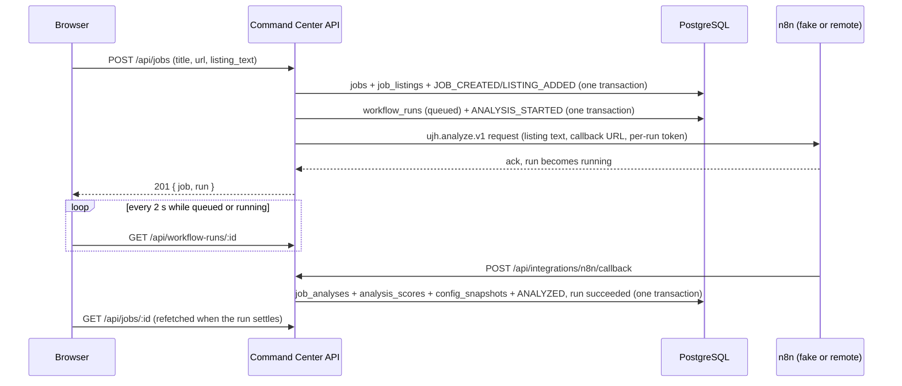

# Manual job analysis

The first vertical slice: paste an Upwork listing, save it as an immutable snapshot, run `ujh.analyze.v1`, persist the immutable analysis, and show it. It works end to end with the fake n8n transport and is ready for the real `UJH-CC Analyze` workflow without UI or domain changes: only `N8N_MODE` changes.

Related: [persistence.md](./persistence.md) (run engine, callback security), [contracts.md](./contracts.md) (payload shapes), [architecture-proposal.md](./architecture-proposal.md) (target design).

## Flow

1. `/dashboard/jobs/new`: title, optional Upwork URL, and the full listing. **Analyze Job** creates the job and starts the analysis in one request.
2. The listing is normalized (Unicode NFC, LF line endings, trailing whitespace per line removed, trimmed), hashed with SHA-256, and stored once in `job_listings`. An Upwork URL with a `~0...` job reference fills `jobs.upwork_ref`; a second job with the same reference returns `409 JOB_EXISTS` with the existing job ID.
3. `/dashboard/jobs/[jobId]` polls the latest run every 2 seconds while it is `queued` or `running` and stops when it is terminal. A run displayed as `timed_out` is checked every 15 seconds until the server fails it. When the run settles, the job query is invalidated and the persisted analysis or failure replaces the running state.
4. **Analyze Again** starts a new run for the current listing. It is offered after a failure, a timeout, or a completed analysis, and only in the `discovered` and `reviewing` stages.

## Tables

All created by `drizzle/0001_jobs_and_analyses.sql`; `drizzle/0002_immutable_history.sql` adds the immutability triggers.

| Table | Purpose | Mutable |
| :--- | :--- | :--- |
| `jobs` | One row per job: title, URL, `upwork_ref` (partial unique), origin (`manual_paste`), stage, `current_analysis_id`, owner override (`manual_score`, `manual_disposition`, `override_reason`), close reason. | Yes |
| `job_listings` | Listing snapshots: normalized text, SHA-256, character count, source URL. A new snapshot is added only when the text hash changes. | No |
| `job_analyses` | One row per successful analyze run (`workflow_run_id` unique): extraction facts, hard filter, system score and disposition, analysis prose, executed versions and models, and the validated `raw_result`. References the exact listing snapshot (composite foreign key with `job_id`). | No |
| `analysis_scores` | The seven dimensions per analysis with score, weight, and evidence. Primary key (`analysis_id`, `dimension`). | No |
| `config_snapshots` | Deduplicated executed configuration (versions, weights, thresholds, executed model identity), keyed by the SHA-256 of its canonical JSON. | No |
| `job_events` | Append-only timeline: `JOB_CREATED`, `LISTING_ADDED`, `ANALYSIS_STARTED`, `ANALYZED`, `DECLINED`, `ANALYSIS_OVERRIDE`, with actor and optional `idempotency_key`. | No |

`workflow_runs.job_id` references `jobs`, and the partial unique index `workflow_runs_active_job_contract_unique` on (`job_id`, `contract`) where the status is `queued` or `running` guarantees at most one active analysis per job, also under concurrent requests (a violation surfaces as `409 ACTIVE_RUN`).

Immutable tables reject `UPDATE` and `DELETE` with a trigger (`ucc_reject_history_change`). Overrides are written to `jobs`, never to `job_analyses`, so the system result always stays visible next to the owner's values. Only `TRUNCATE` (used by the integration tests) bypasses the triggers.

## Analysis lifecycle

| Run state | UI |
| :--- | :--- |
| `queued`, `running` | "Analyzing job..." with a pulse and skeleton. No progress percentage and no n8n step names. A previous analysis, if any, stays visible and dimmed. |
| `succeeded` | Score, disposition, dimensions with weights and evidence, facts, signals, red flags, client problem, why the candidate matches, missing information, recommended positioning, client summary, analysis summary. |
| `succeeded` with a failed hard filter | "Hard filter failed" with the reasons. The job is not scored and not dismissed automatically; the owner decides. |
| `failed` | The safe error message and **Analyze Again**. |
| `timed_out` (read model only) | "Analysis timed out" and **Analyze Again**. Starting a new run first fails the stale run with `TIMEOUT`; a late callback for it is ignored as a duplicate. |

The score counts up with `requestAnimationFrame` and jumps straight to the final value when `prefers-reduced-motion` is set. Proposal strategy, strengths, risks, and generic reasoning from the contract are stored in `raw_result` but not shown.

**Override.** The owner can set a score (1 to 10, one decimal), a disposition, or both. Changing the disposition away from the system value requires a reason. `final_score` and `final_disposition` in the read model are the owner value when set, otherwise the system value. Clearing the override restores the system values.

**Decline.** Allowed from `discovered` and `reviewing`, with a required reason stored in `jobs.close_reason` and in the `DECLINED` event.

## Callback materialization

`materializeAnalysisResult` (`src/server/analyses/materialize.ts`) is the `materialize` hook of `processCallback`. It runs inside the callback transaction, after the run is locked and the per-run token and payload are validated, and before the run is marked terminal:

1. Lock the job row.
2. Upsert the config snapshot (insert on conflict do nothing, then select by content hash).
3. Insert `job_analyses`. The listing ID comes from the run's request summary, so the analysis always refers to the snapshot that was actually sent.
4. Insert the seven `analysis_scores` (skipped when the hard filter failed). A missing dimension or weight throws.
5. Point `jobs.current_analysis_id` at the new analysis and move `discovered` to `reviewing`.
6. Append `ANALYZED` (actor `n8n`, idempotency key `run:<run_id>:ANALYZED`).
7. Return the slim run summary `{ completed_at, analysis_id, config_snapshot_id }`, which becomes `workflow_runs.result`.

Any error rolls back the whole callback, including the run transition, and the callback returns `500`, so n8n can retry it and the run stays active until its deadline. Failure callbacks write no domain rows.

## Transport selection

`getAnalysisRuntime` (`src/server/n8n/runtime.ts`) runs only when an analysis starts.

| `N8N_MODE` | Behavior |
| :--- | :--- |
| unset or `remote` | The real n8n webhook. Requires `N8N_BASE_URL`, `N8N_WEBHOOK_TOKEN`, and `APP_BASE_URL`; if any is missing, starting an analysis returns `503 ANALYSIS_UNAVAILABLE` and nothing is saved. Callbacks also need `N8N_CALLBACK_TOKEN`, otherwise every callback gets `401` and runs end as timed out. |
| `fake` | In-process fake n8n. It acknowledges, waits `N8N_FAKE_DELAY_MS` (default 2500, max 60000), then posts a fixture-based callback through the real callback handler, so authentication, validation, and materialization run exactly as for a real workflow. `N8N_FAKE_SCENARIO` selects `succeeded` (default), `hard_filtered`, or `failed`. |

The fake transport is never selected implicitly. In a production build (`NODE_ENV=production`) `N8N_MODE=fake` is refused unless `N8N_ALLOW_FAKE_IN_PRODUCTION=true`, which only the Playwright test server and CI set. There is no transport selector in the UI.

## API

All routes run on Node, require the owner (`withOwner`: 401 signed out, 403 not the owner), validate input with Zod, and return snake_case read models, never database rows. Errors are `{ error: { code, message, job_id?, run_id?, fields? } }`; validation errors name fields but never echo values.

| Route | Result |
| :--- | :--- |
| `GET /api/jobs` | Paginated list (`page`, `perPage`, `search`, `stage`, `sort`). |
| `POST /api/jobs` | 201 `{ job, run }`; analysis starts by default (`analyze: true`). |
| `GET /api/jobs/:id` | Job detail with listing, current analysis, history, override, latest run, and timeline. |
| `POST /api/jobs/:id/listings` | 201 for a new snapshot, 200 when the text is unchanged. |
| `POST /api/jobs/:id/analyses` | 202 `{ run }`; 409 `ACTIVE_RUN`; 503 `ANALYSIS_UNAVAILABLE`. |
| `POST /api/jobs/:id/transitions` | Decline with a reason. |
| `PUT /api/jobs/:id/override` | Set or clear the owner override. |
| `GET /api/workflow-runs/:id` | `id`, `contract`, `stored_status`, `effective_status`, timestamps, `deadline_at`, and the safe error. |

## Privacy

- The listing text is stored only in `job_listings`. `workflow_runs.request` keeps its ID, length, and hash, never the text.
- Listing text and analysis prose are never logged and never attached to Sentry. Route errors are reported with sanitized errors only.
- `raw_result` holds the validated contract result, which cannot contain tokens: the callback token is part of the envelope, not the result, and only its digest is stored.

## Tests

- Integration (PostgreSQL, private database per run): job creation, duplicate references, snapshots, immutability triggers, decline, list filters, analysis start, active-run conflicts (including concurrency), timeout replacement, late callbacks, failure and retry, persistence, hard filter, materialization rollback, config deduplication, override, and every HTTP route with 401/403/400/404/409/503 cases.
- Unit: listing normalization and references, canonical JSON, materialization rows, runtime mode selection.
- Playwright: `e2e/jobs-analyze.spec.ts` drives the owner flow (create, paste, analyze, running state, result, reload) against the production build with the fake transport. It signs in a dedicated Clerk test user with Clerk's testing token and a sign-in token from the installed SDK (`e2e/support/clerk-auth.ts`), and is skipped unless `E2E_CLERK_USER_ID` is set.

### Enabling the signed-in E2E test

1. In the Clerk **development** instance, create a dedicated test user (not a personal account).
2. Locally: set `E2E_CLERK_USER_ID` and a migrated `DATABASE_URL`, then `bun run build && bun run test:e2e`. The test server treats that user as the owner.
3. In CI: add the repository variable `E2E_CLERK_USER_ID`. CI already provides the database and the fake transport.

## Current limitations

- Only manual paste. Gmail intake, proposal generation, the Kanban pipeline, analytics, and learning are later milestones.
- The real `UJH-CC Analyze` n8n workflow does not exist yet; remote mode returns 503 until it is configured.
- The fake transport delivers its callback with an in-process timer. If the server restarts before the delay ends, the run stays active until its deadline, then reads as timed out.
- Adding a listing snapshot is available in the API but not yet in the UI.
- The signed-in Playwright flow needs a Clerk test user; without it CI runs only the signed-out smoke tests.
