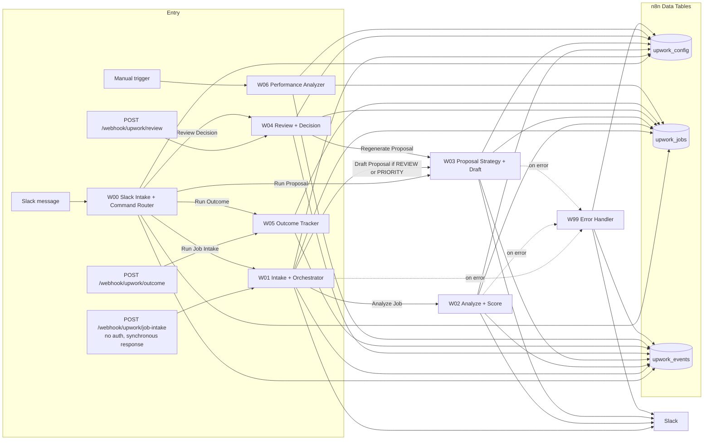
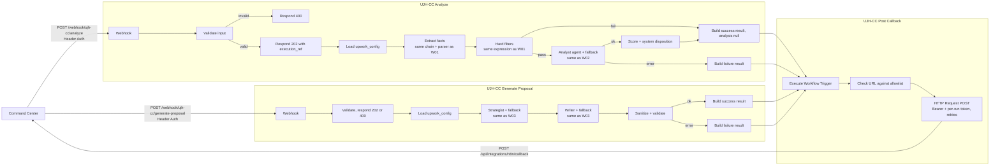

# n8n Refactor Plan: Validating the Architecture Against the Real Workflows

Status: **Approved on October 1, 2026 (decisions below). Not implemented.** No n8n workflow, Data Table, credential, generator, or configuration has been modified. The production Slack workflows (W00 to W06, W99) remain unchanged.

> **OPERATIONAL SAFETY RULE: DO NOT deploy regenerated W01, W02, or W03 workflows until generator drift has been reconciled.**
> The live workflows differ from their generators (Section 16, risk 1). A regeneration using the current generators may silently change which models the existing Slack system executes. The deployed workflows are the behavioral source of truth until the generators are reconciled to reproduce them intentionally.

## Approved decisions (October 1, 2026)

These are final unless implementation evidence proves one technically impossible.

1. **Model drift.** The currently deployed Slack workflows are the behavioral source of truth for the existing Slack system. Do not regenerate or deploy W01, W02, or W03, and do not correct the live model configuration, until the generators have first been reconciled to reproduce the live workflows intentionally. Future Command Center workflows use explicit, versioned model configuration so that the model recorded as executed equals the model that actually executed.
2. **Parallel Command Center workflows.** `UJH-CC Analyze`, `UJH-CC Generate Proposal`, and `UJH-CC Post Callback` are created alongside the Slack workflows. W00 to W06 and W99 remain untouched until the Command Center replacement is proven.
3. **HTTP Request callback.** The "0 HTTP Request nodes" convention does not apply to the Command Center integration. One centralized shared callback mechanism is allowed.
4. **Command Center error handling.** W99 is **not** responsible for Command Center workflow state. CC workflows explicitly catch expected execution failures while they still hold `run_id`, the callback URL, the callback token, and the contract, and call the shared callback workflow with `status: failed`. W99 may remain a secondary operational and Slack error reporter.
5. **Callback allowlist.** n8n execution configuration gains `cc_callback_url_prefixes`; the callback mechanism refuses destinations outside it.
6. **Execution persistence for CC workflows.** Successful executions are not retained by default. Failed executions may be retained for debugging, with short retention. Callback tokens must not remain useful after terminal completion or expiration.
7. **Historical data import: deferred.** No importer now. Existing Data Table history is inspected read-only later, only if there is evidence of meaningful production history.

Companion to [architecture-proposal.md](./architecture-proposal.md).

## Evidence base

All findings come from local files in `upwork-proposal-system/n8n/upwork-job-hunter` (abbreviated `suite/` below). That directory is **not a git repository**, so there is no commit history; file modification times are the only dating.

| Source | What it is | Date (file time) |
|---|---|---|
| `suite/workflows/*.json` | Live exports pulled from the n8n API by `suite/build/export.js` (credential ids stripped). **Source of truth for current behavior.** | 2026-09-30 21:53 |
| `suite/build/w01.js`, `w02.js`, `w03.js`, `lib.js`, `sanitize.js` | Generators that produced the workflows | 17:54 to 21:35 the same day, so the exports are newer |
| `suite/build/ids.json`, `suite/build/columns.json` | Data Table ids and column lists | |
| `suite/config/upwork_config.seed.json` | Config seed. The live `upwork_config` table may differ; it was not read. | |
| `suite/README.md`, user guide, `suite/tests/*` | Descriptions and fixture runners. Used only where the JSON agrees or is silent. | |

Workflow ids: W01 `P6XS81uSeFLCj2oj`, W02 `8b4syVi5QHrCFRl9`, W03 `d0uNAqGnEjpoJNdJ`, W99 `k5ENCNPsgPv6pjw0`. The n8n workflow names follow the pattern `UJH <separator> 01 <separator> Intake + Orchestrator`; this document refers to them as W00 to W99. Data Tables: `upwork_jobs` `Q1h5rsBLYFGObjoC`, `upwork_events` `0h8wR4BaMgLZ7JCI`, `upwork_config` `j4gr98C2Uy9emHsa`.

Not accessed, by design: the live n8n instance, its API, executions, and Data Table contents. Anything that requires them is marked as such.

---

## 1. Executive Summary

- **W01, W02, and W03 are fully stateful.** Each one loads config and job state from Data Tables, makes its own eligibility decisions, writes `upwork_jobs` and `upwork_events`, and posts to Slack. Business logic is inline in each workflow; there are no reusable stateless sub-workflows today.
- **The pure logic is portable.** Identity derivation, hard filters, scoring, disposition, and the em dash sanitizer are deterministic expressions in Set nodes. The LLM steps are self-contained chains or agents with Structured Output Parsers. Everything the Command Center needs can be produced without touching Data Tables.
- **The live workflows have drifted from their generators.** The live W01 extraction model and W02 analysis model are hardcoded to `claude-sonnet-5-5`, and the W02 fallback to `chat-latest`, while the generators use config expressions. The recorded model metadata (`extraction_model`, `analysis_model`) is taken from config keys and therefore does not describe the models that actually ran. Regenerating and redeploying from the generators would silently change the Slack system's models.
- **Several architecture contract assumptions were wrong** and are now corrected in the architecture document: field names (`client_location`, `budget_score`, `competition_score`), the analysis output (no proposal strategy, strengths, risks, or reasoning; the real fields are positive signals, red flags, client problem, positioning, and summaries), the real scoring weights, and the error-code list.
- **Approved migration: build parallel Command Center-facing workflows** (`UJH-CC Analyze`, `UJH-CC Generate Proposal`, `UJH-CC Post Callback`) from the same generator code, reading only `upwork_config`. W00 to W06 and W99 remain untouched, so the Slack system keeps running until the Command Center replacement is proven.
- **The error workflow cannot correlate failures to runs** because the n8n Error Trigger does not expose the failed execution's input. Expected failures must be handled inside the CC workflows with failure callbacks; unexpected crashes are covered by the run deadline.
- **No execution-duration data exists locally.** Requires measurement from the live n8n instance.
- **Existing Data Table contents cannot be assessed locally.** The evidence suggests they are mostly test fixtures.

---

## 2. Current Topology

Evidence: Execute Workflow nodes `Run Job Intake`, `Run Proposal`, `Run Review Decision`, `Run Outcome` (W00); `Analyze Job`, `Draft Proposal` (W01); `Regenerate Proposal` (W04). `settings.errorWorkflow = k5ENCNPsgPv6pjw0` on W01, W02, W03. Data Table nodes are listed per workflow in Section 7.

---

## 3. W01 Audit: Intake + Orchestrator

File: `suite/workflows/01-intake-orchestrator.json` (49 nodes). Generator: `suite/build/w01.js`.

### Triggers and input
- `Job Intake Webhook`: path `upwork/job-intake`, **no authentication parameter**, response handled by a Respond to Webhook node. The response is sent only at the very end (`Called Via Webhook?` then `Respond to Webhook` with `responseCode = {{ $json.status_code }}`), so the webhook caller waits for extraction, analysis, and proposal generation. This is a synchronous long-running webhook.
- `Internal Intake` (Execute Workflow Trigger) with inputs `raw_listing`, `source_url`, `source`, `submitted_by`, `reanalyze` (boolean), `slack_channel`, `slack_thread_ts`, `slack_user_id`. Called by W00.
- `Normalize Request` merges `body ?? $json`. `Valid Input?` requires a non-empty `raw_listing` string; otherwise `Result: Invalid Input` (400).

### Config and identity
- `Load Config` reads all of `upwork_config`; `Build Config` builds a `cfg` map plus `environment`, `slack_channel`, `slack_enabled`, `env_prefix`.
- `Normalize Input`: `normalized_text` is the listing lowercased with whitespace collapsed; `upwork_ref` is the first match of `/~0[0-9a-z]{10,}/i` over `source_url` and the listing, lowercased.
- `Fingerprint Listing` (Crypto): SHA-256 of `normalized_text`.
- `Assign Identity`: `job_id = upwork_ref ? 'upw_' + upwork_ref.slice(1) : 'fp_' + fingerprint.slice(0, 20)`.

### Dedupe (stateful)
- `Find Existing Job` (`upwork_jobs`, get) filters on `job_id` and `fingerprint`. The match type is not set in the export (the README describes it as OR).
- `Is New Job?` false branch: `Reanalyze Requested?` routes to `Analyze Job` with force; otherwise `Attach Slack Thread?` may `Link Slack Thread` (`upwork_jobs` update) and `Result: Duplicate` returns.

### Extraction
- `Extract Listing Facts` (Basic LLM Chain), retry 2, `onError = continueErrorOutput`.
- `Extraction Model (Claude)`: **hardcoded** `claude-sonnet-5-5` (temperature 0, 2048 tokens). The generator `w01.js` uses `cfg.extraction_model_id`, which the seed sets to `claude-haiku-4-5-20251001`.
- System prompt `cfg.extraction_prompt`. The user text appends the refused-conditions list from `cfg.hard_filter_rules`.
- `Extraction Parser` (Structured Output, auto-fix enabled). Schema fields: `title`, `posted_at`, `budget_type` (`fixed | hourly | null`), `budget_min`, `budget_max`, `hourly_min`, `hourly_max`, `connect_cost`, `payment_verified`, `client_location`, `client_total_spend`, `client_hires`, `client_rating`, `proposal_count` (string), `proposals_min`, `proposals_max`, `skills[]`, `job_category` (`NEXTJS_REACT | SENIOR_FULL_STACK | API_INTEGRATION | AI_AUTOMATION | QUICK_FIX | OTHER`), `excludes_us_freelancers`, `is_likely_scam`, `scam_signals[]`, `refused_conditions_found[{condition, evidence}]`, `listing_is_incomplete`, `summary`.
- No fallback model. On error, `Tag Extraction Failed` sets facts to `{}` and `extraction_status = "failed"`, and processing **continues**.

### Persistence and hard filters
- `Build Job Record`, then `Persist Job (INGESTED)` (`upwork_jobs` upsert): identity, `raw_listing`, `title`, `normalized_json` (facts, `extraction_status`, `extraction_model` taken from `cfg`, `extraction_prompt_version`), fact columns, Slack fields, `proposal_version = 0`, `status = INGESTED`.
- `Record INGESTED Event` (`upwork_events`, operation not set, so the node default insert applies), idempotency key `job_id:INGESTED`.
- `Apply Hard Filters` (Set) builds reasons from `cfg.hard_filter_rules`: `US_FREELANCERS_EXCLUDED`, `PAYMENT_EXPLICITLY_UNVERIFIED`, `LIKELY_SCAM: <signals>`, `REFUSED_CONDITION: <condition>`, `INCOMPLETE_LISTING` (when `listing_is_incomplete` or the listing is shorter than `min_listing_chars`).
- `Persist Hard Filter Result` (`upwork_jobs` update): `hard_filter_pass`, reasons, and `REJECT_HARD` status/disposition on failure.
- Failure path: `Record HARD_FILTERED Event`, Slack replies (`Reply Reject In User Thread`, `Notify Hard Reject`), `Result: Hard Reject` (200).

### Orchestration
- `Analyze Job` executes W02 with `{job_id, force_reanalyze: !!existing}`, `onError = continueRegularOutput`. `Analysis OK?` false gives `Result: Analysis Failed` (502).
- `Proposal Eligible?` (disposition REVIEW or PRIORITY) runs `Draft Proposal` (W03, `force_generate = false`).
- `Result: Job Processed`, then `Called Via Webhook?` selects `Respond to Webhook` or `Return To Caller`.

### Settings
`saveDataSuccessExecution = all`, `saveDataErrorExecution = all`, `errorWorkflow = k5ENCNPsgPv6pjw0`. Every execution, including the full listing, is stored in n8n execution history.

### Assessment
| Concern | Stateless candidate? | Notes |
|---|---|---|
| Identity and fingerprint | Yes, and the Command Center should replicate it | Needed so CC job ids can be matched with any imported n8n job |
| Dedupe | No, moves to CC | CC owns `jobs` uniqueness |
| Extraction chain and parser | Yes | Reuse via generator code |
| Hard filters | Yes | Pure expression over facts and `hard_filter_rules` |
| Persistence, events | No, moves to CC | |
| Orchestration (auto-analyze, auto-draft) | No, moves to CC | CC decides; proposal generation is explicit |
| Slack | No | Stays only in the Slack path |

---

## 4. W02 Audit: Analyze + Score

File: `suite/workflows/02-analyze-score.json` (43 nodes). Generator: `suite/build/w02.js`.

### Input and state
- `Start` (Execute Workflow Trigger): `job_id`, `force_reanalyze`. Only callable from other workflows; no webhook.
- `Load Config`, `Load Job` (`upwork_jobs` by `job_id`), `Job Found?`.
- `Needs Analysis?`: `hard_filter_pass !== false` AND (forced OR the stored analysis does not match the current `scoring_version` and `analysis_prompt_version`). Otherwise `Return Existing Analysis`.

### AI reasoning
- `Claude Opportunity Analyst` (Agent), retry 2, max iterations 5, with a `Think` tool.
- `Claude Analysis Model`: **hardcoded** `claude-sonnet-5-5` (temperature 0.2, 4096 tokens). Generator uses `cfg.analysis_model_id` (seed `claude-sonnet-4-6`).
- System message: `analysis_prompt`, `candidate_profile`, `candidate_skills`, `case_studies`, `default_hourly_rate`. User message: `job_category`, facts from `normalized_json`, `source_url`, `raw_listing`.
- `Analysis Parser` schema: `technical_fit`, `budget_score`, `client_quality`, `long_term_potential`, `communication_quality`, `competition_score`, `strategic_fit` (each 0 to 10), `dimension_evidence` (object keyed by dimension; inner fields not required), `red_flag_penalty` (0 to 3), `red_flags[]`, `positive_signals[]`, `client_problem`, `why_candidate_matches[]`, `missing_information[]`, `recommended_positioning`, `client_summary`, `analysis_summary`. **There is no `proposal_strategy`, `strengths`, `risks`, or `reasoning` field.**
- `Fallback Enabled?` (`model_fallback_enabled === 'true'`) runs `GPT Opportunity Analyst (Fallback)` (no retry). `GPT Fallback Model` is **hardcoded** `chat-latest`; the generator uses `cfg.proposal_model_id` (seed `gpt-5.6`).
- `Tag Primary Analysis` / `Tag Fallback Analysis` record `analysis_model` from `cfg.analysis_model_id` or `cfg.proposal_model_id`, **not** from the model node, so stored metadata is wrong whenever the hardcoded node differs from config.

### Validation, scoring, disposition
- `Validate Analysis` checks ranges. Failure: `Mark Job Error` (`upwork_jobs`, status `ERROR`), then `Raise Analysis Failure` (Stop and Error, message `UJH analysis failed for job_id=<id>`).
- `Calculate Score`: `weights = JSON.parse(cfg.scoring_weights)`; `weighted_score` rounded to 2 decimals; `system_score = round1(clamp(weighted_score - red_flag_penalty, 1, 10))`.
- Seed weights: `technical_fit 0.25, budget_score 0.15, client_quality 0.15, long_term_potential 0.15, communication_quality 0.10, competition_score 0.10, strategic_fit 0.10`.
- `Determine Disposition`: `PRIORITY` if `>= score_threshold_priority` (seed 8), `REVIEW` if `>= score_threshold_review` (seed 6), else `LOW`. `final_score = manual_score ?? system_score`; `disposition = manual_disposition || system_disposition`. Status is set to `LOW` or `ANALYZED` only when the current status is `INGESTED`, `ERROR`, `ANALYZED`, or `LOW`.

### Persistence, Slack, output
- `Persist Analysis` (`upwork_jobs` update): dimension columns, scores, `analysis_json` (analysis plus `weighted_score`, weights, `primary_error`), model, fallback flag, `analysis_prompt_version`, `scoring_version`, `analyzed_at`, status.
- `Append ANALYZED Event`, key `job:ANALYZED:<executionId>`.
- `Reply In User Thread`, `Send Slack Analysis` (PRIORITY or REVIEW, when Slack is enabled), `Store Slack Thread` (`upwork_jobs` update of `slack_ts`).
- `Return Result`: `{ok, skipped, job_id, title, job_category, status, system_score, final_score, system_disposition, disposition, analysis_model, analysis_fallback_used}`.

### Assessment
The agent, parser, fallback, validation, `Calculate Score`, and `Determine Disposition` (system half only) are stateless and reusable. `Needs Analysis?`, manual override merging, status rules, persistence, and Slack move out of the CC path.

---

## 5. W03 Audit: Proposal Strategy + Draft

File: `suite/workflows/03-proposal-strategy-draft.json` (55 nodes). Generator: `suite/build/w03.js`.

### Input and gating
- `Start`: `job_id`, `force_generate`, `instructions`. `Load Config`, `Load Job`.
- `Eligible?`: forced OR (disposition REVIEW or PRIORITY AND hard filter passed). `Already Drafted?`: not forced AND `proposal_version > 0` returns `Return Existing Proposal`.

### Strategy (plan) step
- `GPT Proposal Strategist` (Agent v3.1), retry 2, max iterations 3. `GPT Proposal Model` model id is the expression `cfg.proposal_model_id` (Responses API). This node is **not** drifted.
- System message: `proposal_prompt` plus profile, skills, case studies, rate.
- User message reads from `upwork_jobs`: title, category, budget fields, connects, an analysis subset (`client_problem`, `recommended_positioning`, `why_candidate_matches`, `positive_signals`, `red_flags`, `missing_information`, `analysis_summary`), a fixed sentence stating that the owner explicitly requested a proposal (only when forced), `instructions` (otherwise `review_notes`), the previous draft (`job.proposal_draft`), and `raw_listing`.
- `Proposal Parser` schema: `client_real_problem`, `proposal_angle`, `opening_hook`, `relevant_experience[]`, `key_points[]`, `technical_details[]`, `recommended_case_study`, `include_case_study_link`, `recommended_bid_strategy`, `questions_to_client[]`, `risk_to_address`.
- Fallback: `Claude Proposal Strategist (Fallback)` with `Claude Fallback Model` = `cfg.analysis_model_id` (temperature 0.6).

### Writer step
- `Claude Proposal Writer` (Basic LLM Chain), `Claude Writer Model` = `cfg.proposal_writer_model_id` (adaptive thinking, effort medium, 8000 tokens), system message `proposal_writer_prompt`. Plain text output.
- Fallback: `GPT Proposal Writer (Fallback)`, which shares `GPT Proposal Model`.
- `Tag Claude Draft` / `Tag GPT Draft`: `proposal_model = "strategy + writer"`, `strategy_model`, `writer_model`, `writer_fallback_used`.

### Sanitize, validate, version, persist
- `Sanitize Proposal` applies the em dash cleanup (`suite/build/sanitize.js`) to every string field and counts `em_dashes_removed`.
- `Validate Proposal`: draft of at least 200 characters, non-empty angle and hook. Failure: `Raise Proposal Failure` (`UJH proposal generation failed for job_id=<id>`).
- `Determine Proposal Version`: `version = job.proposal_version + 1`; event `PROPOSAL_GENERATED` or `PROPOSAL_REGENERATED`; status `PROPOSAL_READY` unless already submitted or later.
- `Persist Proposal` (`upwork_jobs` update) stores strategy json, angle, case study, draft, version, model, fallback, `proposal_prompt_version`. **Only the latest draft is kept in `upwork_jobs`;** earlier drafts survive only inside `upwork_events` payloads (`Append Proposal Event`, key `job:PROPOSAL:v<N>`, payload includes the full draft and strategy).
- Slack: `Post Draft In User Thread`, `Reply In Analysis Thread`, or `Send Slack Review`.
- `Return Proposal Package`: `{ok, skipped, job_id, status, event_type, proposal_version, proposal_model, proposal_fallback_used, proposal_angle, recommended_case_study, proposal_draft}`.

### Assessment
Strategist, writer, both fallbacks, sanitizer, and validation are stateless. Eligibility, already-drafted, version numbering, persistence, and Slack move out of the CC path.

---

## 6. W99 Audit: Error Handler

File: `suite/workflows/99-error-handler.json` (15 nodes).

- `Error Trigger` provides `execution.id`, `execution.url`, `execution.error.message`, `execution.error.node.name` or `lastNodeExecuted`, `execution.mode`, `workflow.id`, `workflow.name`. **It does not provide the failed execution's input data.**
- `Sanitize Error` redacts secrets and parses `job_id` from the message with `/job_id=([A-Za-z0-9_\-]+)/` (else `SYSTEM`).
- `Fingerprint Error`: SHA-256 of the message. `Find Recent Alert` (`upwork_events` get) looks up `ERRALERT:<fp16>:<yyyyMMddHH>`.
- `Append ERROR Event` (`upwork_events` insert) always runs; `Alert Needed?` then `Send Error Alert` (Slack) once per fingerprint per hour.
- W99 itself has no `errorWorkflow`.

### Consequences for the Command Center
- W99 can learn a `run_id` only if the failing workflow embeds it in the error message (the same trick it uses for `job_id`).
- W99 can **never** obtain the per-run callback token, because tokens are not put in error messages (they would land in Slack and `upwork_events`). Therefore W99 cannot post an authenticated failure callback in v1.
- W99 writes ERROR events to `upwork_events` and alerts Slack for any workflow that names it as error workflow, so CC workflows that use it would add rows to the legacy events table. See Section 13 for the recommendation.

---

## 7. Data Table Dependency Map

Classification: **A** move to Command Center, **B** remain n8n, **C** transitional, **D** needs decision.

| Workflow | Table | R/W | Data | Current responsibility | Future owner | Class |
|---|---|---|---|---|---|---|
| W00 | `upwork_config` | R | Slack channels, environment | Routing config | n8n | B |
| W00 | `upwork_events` | R/W | `Find Processed Event`, `Record Slack Intake`, `Record Slack Command` | Slack event dedupe and audit | n8n while Slack runs | C |
| W00 | `upwork_jobs` | R | `Find Thread Job` | Map Slack thread to job | n8n while Slack runs | C |
| W01 | `upwork_config` | R | Prompts, rules, models, Slack | Execution config | n8n | B |
| W01 | `upwork_jobs` | R | `Find Existing Job` | Dedupe | CC `jobs` | A |
| W01 | `upwork_jobs` | W | `Link Slack Thread`, `Persist Job (INGESTED)`, `Persist Hard Filter Result` | Job record, facts, hard filter result | CC `jobs`, `job_listings`, `job_analyses` | A |
| W01 | `upwork_events` | W | `Record INGESTED Event`, `Record HARD_FILTERED Event` | Audit | CC `job_events` | A |
| W02 | `upwork_config` | R | Prompts, profile, weights, thresholds, models | Execution config | n8n | B |
| W02 | `upwork_jobs` | R | `Load Job` (listing, facts, prior analysis, manual overrides) | Input loading | CC sends input in request | A |
| W02 | `upwork_jobs` | W | `Mark Job Error`, `Persist Analysis`, `Store Slack Thread` | Analysis result, status | CC `job_analyses`, `analysis_scores`, `workflow_runs` | A |
| W02 | `upwork_events` | W | `Append ANALYZED Event` | Audit | CC `job_events` | A |
| W03 | `upwork_config` | R | Prompts, profile, models | Execution config | n8n | B |
| W03 | `upwork_jobs` | R | `Load Job` (analysis subset, previous draft, review notes) | Input loading | CC sends input in request | A |
| W03 | `upwork_jobs` | W | `Persist Proposal` | Latest draft and version | CC `proposal_versions` | A |
| W03 | `upwork_events` | W | `Append Proposal Event` | Audit, draft history | CC `job_events`, `proposal_versions` | A |
| W04 | `upwork_jobs`, `upwork_events` | R/W | Review decisions, overrides | Review state | CC (`jobs` overrides, `job_events`) | A |
| W05 | `upwork_jobs`, `upwork_events` | R/W | Outcomes | Outcome state | CC `applications`, `job_events` | A |
| W06 | `upwork_config`, `upwork_jobs`, `upwork_events` | R/W | Performance analysis | Learning | CC learning tables plus an n8n interpretation workflow | D |
| W99 | `upwork_config` | R | Slack channel | Alert routing | n8n | B |
| W99 | `upwork_events` | R/W | `Find Recent Alert`, `Append ERROR Event` | Alert throttling and error log | n8n (operational, not business state; approved decision 4) | B |

For the Slack path, every A and C row keeps working unchanged during migration. "Future owner" applies to jobs that originate in the Command Center.

---

## 8. Configuration Ownership

Keys from `suite/config/upwork_config.seed.json`.

| Bucket | Keys | Reasoning |
|---|---|---|
| **n8n execution config** (stays in n8n) | `extraction_model_id`, `analysis_model_id`, `proposal_model_id`, `proposal_writer_model_id`, `model_fallback_enabled`, `extraction_prompt`, `analysis_prompt`, `proposal_prompt`, `proposal_writer_prompt`, `performance_prompt`, `*_prompt_version` keys, `environment` | How work is executed. The CC records versions and models from each result. |
| **CC business config** (CC should own eventually) | `score_threshold_priority`, `score_threshold_review`, `performance_min_sample_size` | Business decisions the owner adjusts from learning. For v1 they remain in n8n and are reported back in `versions`. |
| **Transitional** | `scoring_weights`, `scoring_version`, `hard_filter_rules`, `candidate_profile`, `candidate_skills`, `case_studies`, `default_hourly_rate`, `slack_notifications_enabled`, `slack_test_channel`, `slack_production_channel`, `slack_intake_channel`, `review_webhook_url`, `outcome_webhook_url` | Used by both paths. Scoring and profile content are business-relevant (learning will recommend changes) but are consumed inside prompts and scoring nodes today. Slack and webhook URL keys exist only for the Slack path and retire with it. |
| **Unknown** | Any key present in the live table but not in the seed | The live `upwork_config` table was not read. |
| **New (proposed)** | `cc_callback_url_prefixes` | Allowlist for callback URLs (Section 12). |

---

## 9. Contract Gap Analysis

Availability: **directly available**, **derivable**, **small change**, **significant refactor**, **unnecessary**, **missing but recommended**.

### `ujh.analyze.v1`

| Field | Current source | Availability | Required change | Notes |
|---|---|---|---|---|
| `run_id` | none | small change | Accept in webhook body, echo in callback | |
| `callback.url`, `callback.token` | none | small change | Accept, pass to callback sub-workflow | Never logged in error messages |
| `listing_text`, `source_url` | W01 input | directly available | Read from webhook body | |
| `job.upwork_ref` | `Normalize Input` | derivable | CC computes with the same regex | Not needed by n8n |
| `extraction.facts.*` | `Extraction Parser` | directly available | None | Live field names kept |
| `extraction.status`, `extraction.error` | `Tag Extraction OK/Failed` | directly available | Include in result | |
| `hard_filter.pass`, `reasons` | `Apply Hard Filters` | directly available | Reuse expression | |
| `analysis.scores` (7) | `Analysis Parser` | directly available | None | Names `budget_score`, `competition_score` |
| `analysis.dimension_evidence` | `Analysis Parser` | directly available | None | May be partial |
| `analysis` narrative fields | `Analysis Parser` | directly available | None | |
| `weighted_score`, `system_score` | `Calculate Score` | directly available | None | |
| `system_disposition` | `Determine Disposition` | small change | Keep only the system half; drop manual override merge and status logic | |
| `analysis = null` on hard-filter failure | W01 routing | small change | Route hard fails straight to success callback | |
| `versions.scoring`, prompt versions | `cfg` | directly available | Copy into result | |
| `versions.scoring_weights`, `score_thresholds`, `hard_filter_rules` | `cfg` | directly available | Copy parsed values into result | |
| `versions.workflow` | none | small change | Generator-stamped constant (Section 14) | |
| `versions.profile_hash` | none | missing but recommended | Hash of profile, skills, case studies, rate | Detects prompt-input changes that have no version key |
| `models.extraction`, `models.analysis` | `cfg` label (wrong today) | small change | Report the same expression that configures the node | Requires drift reconciliation |
| `models.analysis_fallback_used`, `primary_error` | `Tag Fallback Analysis` | directly available | None | |
| `execution_ref` | `$execution.id` | directly available | Include in 202 and callback | |
| `usage` (tokens, cost) | none | significant refactor | Return `null` | Not exposed on n8n 1.121 per README |
| `features` (boolean signals) | none | unnecessary for v1 | None | Add to the extraction schema later if learning needs it |
| `job_id` (n8n format) | `Assign Identity` | unnecessary | None | CC owns ids |
| `final_score`, `disposition` (with overrides) | `Determine Disposition` | unnecessary | Remove from CC path | CC applies overrides |

### `ujh.generate_proposal.v1`

| Field | Current source | Availability | Required change | Notes |
|---|---|---|---|---|
| Job fields (title, category, budget, connects) | `Load Job` | small change | Read from request instead of table | |
| Analysis subset (7 fields) | `Load Job` (`analysis_json`) | small change | Read from request | |
| `listing_text` | `Load Job` | small change | Read from request | |
| `base_version.body` | `job.proposal_draft` | small change | Read from request | CC chooses which version |
| `base_version.number` | `job.proposal_version` | unnecessary for n8n | Informational only | CC numbers versions |
| `instructions` | input or `review_notes` | small change | Request only; drop `review_notes` fallback | |
| "Explicitly requested" prompt text | `force_generate` branch | small change | Always on for CC runs | Every CC run is an explicit request |
| Eligibility, already-drafted checks | `Eligible?`, `Already Drafted?` | unnecessary | Remove from CC path | CC decides |
| `body` | writer output after `Sanitize Proposal` | directly available | None | |
| `strategy` (11 fields) | `Proposal Parser` | directly available | Return full object | |
| `models.strategy`, `models.writer`, fallback flags | `Tag Claude Draft` / `Tag GPT Draft` | directly available | Split `strategy_fallback_used` and `writer_fallback_used` | Both exist in tags |
| `sanitizer.em_dashes_removed` | `Sanitize Proposal` | directly available | None | |
| `versions.proposal_prompt`, `workflow`, `profile_hash` | `cfg` / none | small change | As for analyze | One version key covers both strategist and writer prompts today |
| Version number, status, event type | `Determine Proposal Version` | unnecessary | Remove | CC owns |

---

## 10. Stateless Target Design

Rules for the new workflows:
- Read `upwork_config` only. Never read or write `upwork_jobs` or `upwork_events`. No Slack nodes.
- No eligibility, dedupe, override, version-numbering, or status logic.
- Every model-reporting field uses the same expression that configures the model node.

---

## 11. Migration Strategy

### Approved: parallel workflows, generator-level reuse

1. **Reconcile generator drift first** (Section 16, approved decision 1). The live workflows are the source of truth: make the generators produce exactly the live workflows (verified by diffing a fresh generator output against `suite/workflows/*.json`). Until this is done, no generator-based deploy should happen.
2. **Refactor generator code, not runtime workflows.** Move the node builders for extraction, hard filters, analysis, scoring, strategist, writer, and sanitizer into shared functions in `suite/build/lib.js` (or a new module). W01, W02, and W03 generators call them and must produce byte-identical output to the reconciled workflows; the new CC generators call the same functions.
3. **Create three new workflows:** `UJH-CC Post Callback`, `UJH-CC Analyze`, `UJH-CC Generate Proposal`. New webhook paths under `ujh-cc/`. Deployed inactive first, tested with fixtures, then activated.
4. **Leave W00 to W06 and W99 untouched at runtime.** Slack intake, review, outcomes, and alerts keep working exactly as today.

### How Slack keeps running
The Slack path and the CC path share only `upwork_config` (read-only) and generator code. A CC run never writes to the Slack system's tables and never posts to Slack. A broken CC workflow cannot break Slack processing. The two systems can run side by side indefinitely, and retiring Slack is a separate later decision.

### Rejected alternatives
- **Modify W01 to W03 in place to accept a "CC mode".** Puts the working Slack system at risk with every change, and mixes stateful and stateless branches in one workflow.
- **Extract shared runtime sub-workflows now** (W02 and the CC workflow both calling one "Analyze core" sub-workflow). Cleaner long term, but requires modifying W02 and W03 now. Reconsider after Slack is retired or once the CC path is proven.

### Known tradeoff
Logic is duplicated at runtime (two copies of the analyst node), and the copies can drift if someone edits a workflow in the n8n editor instead of the generator. Mitigation: the generator is the only edit path, and a drift check (regenerate and diff against export) runs before each deploy.

---

## 12. Callback Design

Design only; nothing is implemented.

- **Where the HTTP Request node lives:** only in `UJH-CC Post Callback`, a sub-workflow with an Execute Workflow Trigger. This is the suite's first HTTP Request node (approved decision 3).
- **How workflows invoke it:** `UJH-CC Analyze` and `UJH-CC Generate Proposal` end with an Execute Workflow node (wait for completion) passing `{callback_url, callback_token, body}`. `body` is the full contract payload (`contract`, `run_id`, `status`, `completed_at`, `execution_ref`, `versions`, `models`, `result` or `error`).
- **Success and failure:** the same sub-workflow sends both. The calling workflow builds `status: "succeeded"` or `status: "failed"` with an `error {code, stage, message, retryable}`.
- **Headers:** `Authorization: Bearer <N8N_CALLBACK_TOKEN>` from an n8n Header Auth credential (never an expression or config value); `Content-Type: application/json`. The per-run token travels in the body as `callback_token`.
- **Propagation of `run_id` and per-run token:** both come from the webhook body, are carried as fields through the workflow (for example referenced from the webhook node by name), and are passed to the sub-workflow. They are never interpolated into error messages, Slack text, or Data Tables. `run_id` (not the token) may be embedded in error messages for correlation.
- **Callback URL handling and allowlisting:** the sub-workflow checks that `callback_url` starts with one of the prefixes in `cc_callback_url_prefixes` (comma-separated `upwork_config` key, for example the production origin plus `/api/integrations/n8n/callback`). On mismatch it does not send, and it raises an error naming the run.
- **Delivery failure:** HTTP Request with a 10-second timeout and `retryOnFail` (3 tries, 5 seconds apart). On final failure it raises an error. The Command Center then sees the run as effectively timed out at its deadline, and the owner can retry. Persisting undelivered results in an n8n Data Table for redelivery is out of scope for v1.
- **Execution retention (approved decision 6):** the Slack workflows save all executions (`saveDataSuccessExecution = all`). CC workflows will not retain successful executions; failed executions are retained briefly for debugging. Per-run tokens are single-use: the Command Center rejects them once the run is terminal, so a token found in a retained failed execution is useless.
- **Allowlist (approved decision 5):** enforced in `UJH-CC Post Callback` from `cc_callback_url_prefixes`.

The webhook node of each CC workflow uses Header Auth (`X-UJH-Token`), validates input, then sends Respond to Webhook (202 with `execution_ref`, or 400) **before** processing continues. That continuation behavior must be verified on the live n8n 1.121 instance before relying on it.

---

## 13. Error Propagation

| Failure | Where caught | What the CC sees |
|---|---|---|
| Invalid input | Webhook validation | Synchronous 400; run marked failed (`INVALID_INPUT`) |
| Extraction model failure | Error output of extraction chain | Not an error: success with `extraction.status = "failed"` (matches live behavior) |
| Analyst primary and fallback both fail | Error branch after agents | Failure callback `MODEL_ERROR`, retryable |
| Analysis fails validation | `Validate Analysis` false branch | Failure callback `MODEL_OUTPUT_INVALID` |
| Strategist or writer failure, proposal fails validation | Error branches, `Validate Proposal` | Failure callback `MODEL_ERROR` or `MODEL_OUTPUT_INVALID` |
| Callback delivery fails | `UJH-CC Post Callback` | Effective timeout at deadline |
| Unexpected node crash | Error workflow only | Effective timeout at deadline |

Rules:
- CC workflows use error branches (`onError = continueErrorOutput`) on every LLM node so expected failures produce failure callbacks instead of Stop and Error.
- Stop and Error messages, where still used, embed `run_id=<id>` (never the token).
- **Error workflow (approved decision 4):** W99 never updates Command Center state. Expected failures are caught inside the CC workflows and sent through `UJH-CC Post Callback` with `status: failed`. W99 may remain the error workflow for operational Slack alerts on unexpected crashes; note that it also inserts ERROR rows into `upwork_events` and records `job_id` as `SYSTEM` for CC runs. Whether to accept those rows or add an alert-only handler is an implementation detail for the CC workflow milestone.
- Optional later: a correlation table (`run_id` to callback URL and token) so an error handler can post failure callbacks. Not in v1.

---

## 14. Version and Config Snapshot Strategy

- **Workflow version:** a constant string stamped by the generator at build time (for example `cc-analyze@2026-10-05.1`), placed in a Set node and copied into every result. Bumped manually when the generator for that workflow changes. No registry, no semver tooling.
- **Prompt and scoring versions:** existing `cfg` keys (`extraction_prompt_version`, `analysis_prompt_version`, `proposal_prompt_version`, `scoring_version`) copied into `versions`.
- **Applied values:** parsed `scoring_weights`, thresholds, and `hard_filter_rules` copied into `versions`, so the CC can record exactly what was applied even if someone edits config without bumping a version.
- **Profile hash:** a short hash of `candidate_profile`, `candidate_skills`, `case_studies`, `default_hourly_rate` (Crypto node), because these change prompt behavior and have no version key.
- **Models:** the expression that configures each model node, reported alongside fallback flags.
- **CC side:** `config_snapshots` upserts by content hash of the whole `versions` plus `models` block.

---

## 15. Existing Data Migration

| Data | Location | Classification | Notes |
|---|---|---|---|
| Jobs (identity, listing, facts) | `upwork_jobs` | Importable later if real data exists | Identity format is reproducible by the CC |
| Latest analysis | `upwork_jobs.analysis_json` and columns | Importable with caveats | Model metadata unreliable (Section 1) |
| Proposal history | latest in `upwork_jobs`, earlier drafts in `upwork_events` payloads | Importable with effort | Requires reconstructing versions from events |
| Review decisions, overrides, outcomes | `upwork_jobs`, `upwork_events` | Importable later | Status mapping in architecture Section 4 |
| Slack and error events | `upwork_events` | Do not import | Operational, not business history |
| Config | `upwork_config` | Not migrated | Remains n8n execution config |

**Volume and real versus test split: impossible to determine locally.** No Data Table export exists in either repository, and reading the live tables was out of scope. Evidence suggests mostly test data: fixtures are tagged `source = test_fixture`, the suite was validated against live Slack on 2026-09-30, and the config seed has `environment = test`. Approved decision 7: the import is deferred until a read-only inspection shows meaningful production history; CC tables are designed so an import is additive.

---

## 16. Risks

1. **Generator drift (high).** Live W01 and W02 model nodes are hardcoded (`claude-sonnet-5-5` for extraction and analysis, `chat-latest` for the analysis fallback) and differ from generator output. Any regenerate-and-deploy changes the Slack system's models silently. **DO NOT deploy regenerated W01, W02, or W03 until drift is reconciled.** Mitigation: reconcile the generators to reproduce the live workflows, then add a regenerate-and-diff check before every deploy.
2. **Wrong historical model metadata (medium).** Stored model labels come from config, not from the nodes. Do not use imported history for model comparisons.
3. **Duplicated logic drifts between Slack and CC paths (medium).** Mitigated by generator-level reuse and the drift check.
4. **Early webhook response behavior unverified (medium).** If n8n 1.121 does not continue after Respond to Webhook as expected, the CC webhooks need a different pattern (for example the webhook executing the processing workflow without waiting). Must be verified on the live instance.
5. **Secrets and listings in execution history (low to medium).** The Slack workflows save all executions. Mitigated for CC workflows by approved decision 6 (no successful-execution retention, short failed retention, single-use tokens).
6. **Callback reachability (medium).** Host or URL changes break callbacks until the allowlist is updated; visible as timeouts.
7. **Unauthenticated legacy webhooks (existing).** `upwork/job-intake`, `upwork/review`, `upwork/outcome` have no authentication today. Out of scope for this plan, but worth fixing independently.
8. **Execution durations unknown.** Deadlines cannot be set from data. Requires measurement from the live n8n instance.
9. **Live config may differ from the seed.** Contract fixtures derived from the seed (weights, thresholds, models) must be confirmed against the live table.

---

## 17. Decisions

All seven owner decisions from the original audit were approved on October 1, 2026 and are recorded in [Approved decisions](#approved-decisions-october-1-2026) at the top of this document.

Unresolved technical questions (not owner decisions):
1. Measured execution durations for analyze and proposal runs. Requires measurement from the live n8n instance.
2. Whether n8n 1.121 continues executing after an early Respond to Webhook node (risk 4).
3. Whether the live `upwork_config` matches the seed (risk 9).
4. How n8n execution retention is configured per workflow on the live instance to satisfy decision 6.
5. Whether token usage can be returned on n8n 1.121.

---

## 18. Implementation Order

Each step starts only after the previous one is reviewed.

1. **Foundation (CC repo).** Node 24, test tooling, CI, env schema, owner guard. No n8n contact.
2. **Contract scaffolding (CC repo).** Zod schemas and fixtures for `ujh.analyze.v1`, `ujh.generate_proposal.v1`, `ujh.health.v1`, derived from the parser schemas in Sections 3 to 5.
3. **n8n preparation (suite; follows approved decisions 1 to 6).**
   1. Measure execution durations and verify early-respond behavior on the live instance (read-only test workflow).
   2. Reconcile generator drift; add regenerate-and-diff check.
   3. Factor shared node builders; prove W01 to W03 regenerate identically.
   4. Build `UJH-CC Post Callback` and a health workflow; then `UJH-CC Analyze`; then `UJH-CC Generate Proposal`. Deploy inactive, test with fixtures.
4. **Database (CC repo).** Drizzle and first migration.
5. **Run engine and analyze UI slice (CC repo).** Callback route, polling, derived timeout, then paste-and-analyze against `UJH-CC Analyze`.

Proposal UI, outcomes, intake, analytics, and learning follow as in architecture Section 13.
